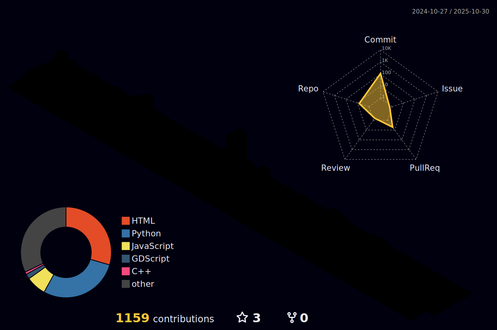

<!---->
#   
<picture></picture>

[![Portfolio](https://img.shields.io/badge/Portfolio-%23000000.svg?style=for-the-badge&logo=data:image/png;base64,iVBORw0KGgoAAAANSUhEUgAAACQAAAAkCAYAAADhAJiYAAAACXBIWXMAAA7EAAAOxAGVKw4bAAAHdUlEQVRYw92X228cVx3HP2dmd2fvF+/da+/6FjuxUzvXpqVpWhpKEEFBCRX/AEJCSLRIiEceyCOvfekLEhepCIFqQYuEIoHaFEhT2iYhbeIkdm52bK+93vvszs7uzOHBje3g9OLIeWHezplz+Z7v7/f9ne+B/7fvpYl9b44GQ7e3az3xqBOfH9n9gyj8cJ/b/8RypcSRZw8zNTXFJ5UlFkorZBIZOj7fq797/72Xt7KuY6tATp48meheLp/ZFYhMKNUKNxbnyCstLk59wmgiw3hugFRfjnsLi2TSqR8JIezXz5/78ZddX90qoKPR5LkJSxlfpEzP/jRHjh/kxIlneerIKLm9GW62Dd49+y806eLpnTsZT/c8da9e672WX/jzYwnZiWyf3DvQzY7xHhRFsP/gGIl4hGatQTCVRs0M0G6bmAtznP/T2wTKGoFo3N77i9Nf6vDKVgHNGAYtvwMhQFUVnA4VRUp8Pg9WrYxtNlE1N1o4wuGv7yEwHIRoS3n5yAv3th3QaDy2DHB5ep5itQFAo2HSaLTWxsi2CdLGXrgFQM9oAoC2aaS2PWR7E3Fpbkw7IRhIRUj6nHzvpReQUiIcTpRQFzvTvrUNZi7e46XTr9ozekPdVpWZUqEaHFzH409wCYF95waVyQ8B+Gg6jyFVXKrKi/tHODqRIBfzkOgKMqM3tjdkZaP9QNsuTGMXbgBwoD8EgBUZwxkdRYZHODMDP5ucZ6HpIp0MyW2tQwPhwN9dtkF17gOc3gB2pw2mgaKoZCJejh76Jv+8OIlcnMa+v7giMKXkt3+8at24syy2Nak1VR3ojQbRhIVlGnTaLQQ2IU3h2MFRMokIxw/vRrUbqJaOaunIdh2fmSfocKgNW765rQwJIUQ2FQMEt/NFLCEZ60+SjIQZGcggEIzkMuTiYW4tldZVJ2FkqBfg2zMrpe2r1DGP9kpQ08Its82po0/y3RcPEfB6uXp7lr+8+yHNhoHR6bB7ME2lUMZS3HQFfJx4fh/fOXqIX585b98tVk9vn8pUdca0rL49wznCPo2v7N/F9Gye+fwKQkKhWMOoNzj21Sd5+pWdmJ0OC/kV9uwepKY3sazO9l6uV5eKX0v5NXlrvgDA1PQsXs3FyaPPMJhNsnd0kFDAi9xQ3bpTXQjAtCzcPt+vHsNtL7CBmfllTr/2e6S0URSFW7MpVso1ntiRZWSgZ01l95Pobx9dLV2/tfDqY7Ef94GVazUEMNSbpVxv8Zs336bWaBB0e3hm/y5++v1TSAnnrtzkJ69Ndj0eP7Shkgxlcwgp6e2O8dyB3YQDXvxBDx9cmEIIARKElLzxzoUPtrLFlvyQ3+E4FfV7kxvxVWsN/nPtNkGfi4ld/YwN9yEtm8JKhY9m5kqnX//r0GNzjB8vlyaEUZOpeJShbA+ZeIix4T7ikQCD2fTauFwuzRtvneX9u3pmq8mwJUBj8fBdtdNkfmlVaZl4iLDf8wCYK9fvcOYfF7hZEd7HavJ3Rvy1bDzsl502hVKZdruD5nKR607Rm4gR9LnRWyb3lkpcXyxWh/p3pAD+cO5c85EZysVSx12qeKtSKV6WbfOJjf+8n2abPxTCH1q92UuVKnWzzcxiAUVRSEZC7BrIIBXhO/vxlZ/rpvFL4NojM7QjmZYA1ZU8ttzsFsZySSKh4Fq72WyhKAqRUIAd6eha//RcnkvzNQAuz82KR2IoG0+cTfYOkJ+9+alsNwP65E6ew+NBhrvjONTPNgr3wQBM9A3Jml6v31xeDGyJoWws8U7/yPgRgOrSHA29jtnQ0esVpC03TcmlIgylY0SDXhyqA4mkUK5y6dpd2qpGYsdqxPXi8rrjtDu2bhiXq63mt4rF4tznMuRwamvggoke1EoBumJEgTtXLm2aeGexxFyh/ICx0jQvgViGSCz90NNH4mklAhP5/PyHxWIx+fkGTf3sGjk08eQX25NMH4FYAn80+YVjk8nuxIHxA53PZUjaNt7Q+pXjDXVRXZ7HqJTxRJL0j+5hduoi1obcsm1BsCtGLJnFE11Paqu97r07rQ2qF+vn19xudTg7IMf2T8QmJydXNjEkHpKjwXg3QkjqpSX80RRuX/BBn71rH7FkFl9X9AtZCaezD7TbhrEqgPf+/Y2HhkwI8VB5xgfHVgeqCv37nqUr2UMoniYUjq3WpXgS1/8Avf/phYV1RvwhAtH13CqXi6sPzWrl2EMB2daqlMxmY/VFsRYWC6NWxmzouD1e+sYP0j9+iGimj1J+jvz0FYxaGbc3CGYb22zj9gZwOTXazQYSiaq5EaoKUhKIpnBqHuKpDC7LBGQiCb7NDH0qZ9OoYzb1tV5FceD2hWjWSlhWB0V1oDqchNNZ/F0xWnqNeiEPto3T60faFu2mjl4uIKWNEAJPIIzT6aFZLWFbHTyBEMFoCpfXh8flOuaOx4c3JbXRqHF76iJmU0dVnThc2lrVaVaKWFaHuq4jFHWt39RrNBs65uIclXoVRVGx2iZOzU2zUqTTNhAIGi2TaqWK0ayhOBw4XW6QYFRWaDZ0hKadAi4A/BeDJfI4b+k4BAAAAABJRU5ErkJggg==)](https://yuantianle.com)
[![TechBlog](https://img.shields.io/badge/Tech%20Blog-%23161b22.svg?style=for-the-badge&logo=data:image/png;base64,iVBORw0KGgoAAAANSUhEUgAAABMAAAAUCAYAAABvVQZ0AAAACXBIWXMAAA7EAAAOxAGVKw4bAAADCElEQVQ4y32Ub2jVVRjHP+fsd3Htjk1WVyktKyr740aLIhldIVqGZAW9chr6IqV/0AsLVvSyKHwXCL0skrAVSJHFDEyJIKQ/i7GENC0SwWpobXl3c7u/8+nNGYxLdeDA4Tzn+ZzzfM/zPNA21KCuVp9TD6t/qk11Rj2qPp/tgf8barc6qp5S96tb1HVzc3Or1MFWq/W4Oq6eUV9Qu/8LVFPH1EPq4JL9AXX10rMLCwsb1Qn1fbXWDqqq+/Lsa7M9q15Qd7XtX6d+rr6jVgFijn07cBXwGjCsdmXtCmAF0AF0q12LrwVuAJ4C7gB2qGExvEl1g3qLelytq8+oe9Rz6gH1U/U99XJ1q/pl9n1aPanWYlmWm4EzjUbjBPAEcDCldBewDtgFfAPMAieAe1NKO4FHgA+AYeBdoAU8HEMIm1JKH1er1QTU1JtjjPWU0pT6O/A28BXQCTRijAnoA+4D1gIzwBHggRhjHCzLchK4CPwcQhD4MMb4RwihCxjKoJNZ+0mgkVI6DXwNFGVZfgesL4AVlUrlAlAHdqaUjsQYd+cbzYDbU0pFjLEEtgADMca/gL3Akx0dHdPAyiL/VAX4CTgQY/wW+AS4FZgA+oH+GOOrwCngRyABH2UdLwI9AAVwDrgmhDCujgL3A5eAQ1nY9cAG4GqgO69ptVozRVHsyWd2A2eLLO496uEMGQC2Ag1gVh0IIVSAR4Ex4DOgtyiKu4FjOe/qIYRj5Pr7Xu1TK2qnukbtV99KKR1VG+pB9RW1Nyf0sjxvU39TR4K6XP0ihLAPOA7cBDSBx4DlwIvAfuAh4M2s7RhwRc7BEXUohDC0WGfbcifYro6nlObVH3IlbM4vW6NuVH9R/85VMaqeV7ctLdpOda96Wt2hDqurcjj1lNLZZrN5vRrVazN0NKU0nf062ztHTzZMq6+rN2ZYUFdmUJyfn78z97pZ9Q21Z5ER2oDLgBHgJaAGTKWUpmKM54Er1cEQwlrgV+BlYCyEcOlfYUugvcAm4MHcYi7LnzKRE3o8hDDT7vcPnW9/90L+NfwAAAAASUVORK5CYII=)](https://yuantianle.github.io/)

I'm a Software Developer deeply passionate about crafting immersive Game Development experiences, pushing the boundaries of Computer Graphics, and diving into Full-stack projects. My journey has been an exhilarating blend of creativity and technology, where I've honed my skills in designing engaging games, visually stunning computer graphics, and robust Full-stack applications. In my recent role as a Technical Art Lead, I delved into character design, sprite processing, URP, VFX, and advanced animation techniques, fostering a love for innovation.

Simultaneously, my previous academic endeavors led me to roles like Graduate Teaching Assistant and Research Software Developer at Oregon State University, where I shared knowledge and contributed to groundbreaking projects in real-time 3D crack generation frameworks and regex password decryption libraries. Venture into my GitHub repository, where innovation and captivating projects await. Whether you're a developer, a gaming enthusiast, or simply curious about the fusion of technology and creativity, explore these repositories and witness the evolution of my skills and passion. Let's embark on this software development adventure together!

<picture></picture>

# Contributions

|Topics|Source|
|:-|:-|
|$\textcolor{#ebc7d7}{\textsf{Unity Shader Graph Cheat sheets}}$| [www.cheatsheets.zip](https://cheatsheets.zip/unity-shader-graph.html)|

# Projects

## Game Projects

|Topics|Demos|Source Code|
|:-|:-|:-|
|$\textcolor{#f15b40}{\textsf{Unity 2D adventure game (Contributing)}}$| - | - |
|$\textcolor{#f15b40}{\textsf{UE5 ESP32 flight simulator (Unannounced)}}$| - | - |
|$\textcolor{#f15b40}{\textsf{Marcus shooting!}}$| <code>[Demo1](https://github.com/yuantianle/MarcusShooting-ING-Nov2023/assets/61530469/b84fc2b3-42e4-4e79-a44a-0b8e47db8acf)</code> <code>[Demo2](https://github.com/yuantianle/MarcusShooting-ING-Nov2023/assets/61530469/7e98c388-8330-4f9f-b93c-3de18ba5aea0)</code><code>[Demo3](https://github.com/yuantianle/MarcusShooting-ING-Nov2023/assets/61530469/a7d45ade-c398-4931-b3cb-c20d89331b92)</code><code>[Demo4](https://github.com/yuantianle/MarcusShooting-ING-Nov2023/assets/61530469/906a3bb7-f787-4fa3-ae9d-ecc4f68b16f9)</code><code>[Demo5](https://github.com/yuantianle/MarcusShooting-ING-Nov2023/assets/61530469/ba19780e-5227-476b-96fb-2eab4160bcae)</code>| <code>[Source Code](https://github.com/yuantianle/SimpleShootingGame-ING-Nov2023)</code> |
|$\textcolor{#f15b40}{\textsf{Horrible room exploration}}$|<code>[Demo1](https://user-images.githubusercontent.com/61530469/273417143-bf9bbe60-d732-45fc-9064-1b5ed8ed80e3.png)</code> <code>[Demo2](https://user-images.githubusercontent.com/61530469/273417117-04abccae-a755-4db5-b25e-966fa9149563.png)</code> <code>[Demo3](https://user-images.githubusercontent.com/61530469/273417126-61ef8694-8a70-43e8-8c84-e22a292fa9ba.png)</code>|<code>[Source Code](https://github.com/yuantianle/Horrible_Room_Exploration-Nov2020)</code>|
|$\textcolor{#f15b40}{\textsf{Unity Angry Birds Cover}}$|<code>[Demo1](https://user-images.githubusercontent.com/61530469/178088061-a6fe905f-485a-4e32-845d-351f664f6016.png)</code> <code>[Demo2](https://user-images.githubusercontent.com/61530469/178088063-782d3738-4a3a-4698-abcf-511c31ffb486.png)</code>|<code>[Source Code](https://github.com/yuantianle/Angry_Birds_Unity-ING-June2022)</code>|
|$\textcolor{#f15b40}{\textsf{Mark's Zelda}}$|<code>[Demo1](https://user-images.githubusercontent.com/61530469/184768142-3a50cd59-38ab-43d2-b3dd-d615bfcb0b2b.jpg)</code> <code>[Demo2](https://user-images.githubusercontent.com/61530469/184768187-b1dad7f0-0928-4ec6-ae69-97a157551f91.jpg)</code> <code>[Demo3](https://user-images.githubusercontent.com/61530469/184768300-15682aee-24e7-49bf-9932-dbdcb8b9696d.jpg)</code>|<code>[Source Code](https://github.com/yuantianle/MarkZelda_Terminal_Game_2-BC-Aug2022/tree/main)</code>|
|$\textcolor{#f15b40}{\textsf{Mark's Zoo}}$|<code>[Demo](https://user-images.githubusercontent.com/61530469/182746379-817b4573-7bb2-4535-abd8-ef71abe883b6.png)</code>|<code>[Source Code](https://github.com/yuantianle/MarkZoo_Terminal_Game-BC-Aug2022)</code>|

## Scientific Visualization

|Topics|Demos|Source Code|
|:-|:-|:-|
|$\textcolor{#fdb64e}{\textsf{Graphical Calculator}}$|<code>[Link](https://marcus-graphic-calculator.vercel.app/)|<code>[Source](https://github.com/yuantianle/Graph_Calculator-ING-Oct2023)</code>|$\textcolor{#fdb64e}{\textsf{Oren Nayer diffusion and Cook Tarrance specular}}$|<code>[Demo1](https://github.com/yuantianle/Orennayer_and_Cooktarrance_Light-Mar2022#project-1-oren-nayer-diffusion)</code> <code>[Demo2](https://github.com/yuantianle/Orennayer_and_Cooktarrance_Light-Mar2022#project-2-cook-tarrance-specular)</code>|<code>[Source](https://github.com/yuantianle/Orennayer_and_Cooktarrance_Light-Mar2022/tree/main/Source%20Code)</code>|
|$\textcolor{#fdb64e}{\textsf{Greybody shadowing}}$|<code>[Demo1](https://github.com/yuantianle/yuantianle/assets/61530469/8d3e86cb-87b9-4d58-bd40-8ebd0a010bad)</code> <code>[Demo2](https://user-images.githubusercontent.com/61530469/274123804-e1318297-095d-4ed7-a1f5-03597b918525.png)</code> <code>[Demo3](https://user-images.githubusercontent.com/61530469/274123595-597b8fde-e0a3-492a-8365-a1f237bde4af.png)</code> <code></code>|$\textcolor{grey}{\textsf{closed source}}$|
|$\textcolor{#fdb64e}{\textsf{Voronoi subdivision}}$|<code>[Demo1](https://github.com/yuantianle/Voronoi_Subdivision-Jan2022/tree/main#section-1-voronoi-type-with-different-seed-distribution)</code> <code>[Demo2](https://github.com/yuantianle/Voronoi_Subdivision-Jan2022/tree/main#section-2-methodology)</code> <code>[Demo3](https://github.com/yuantianle/Voronoi_Subdivision-Jan2022/tree/main#section-3-art-stylization-based-on-the-algorithm)</code> <code></code>| <code>[Source](https://github.com/yuantianle/Voronoi_Subdivision-Jan2022/tree/main/SourceCode)</code>|
|$\textcolor{#fdb64e}{\textsf{Thermal dynamics on 2D mesh surface (FEM)}}$|<code>[Demo1](https://user-images.githubusercontent.com/61530469/274078866-4b681c22-e4c9-45bb-addc-3734cb80caeb.gif)</code> <code>[Demo2](https://user-images.githubusercontent.com/61530469/274078897-9d8dfd07-b233-4d59-9722-602d4b60caa9.gif)</code> <code>[Demo3](https://user-images.githubusercontent.com/61530469/274078909-20012676-030b-47db-a319-ce53fc96b85b.gif)</code> <code>[Demo4](https://user-images.githubusercontent.com/61530469/274078925-e34d50a1-40ae-41ba-b45e-b277f6aafd2f.gif)</code> <code></code>| <code>[Source](https://github.com/yuantianle/Thermal_Dynamics_2D-Mar2022/tree/main/SourceCode)</code> |
|$\textcolor{#fdb64e}{\textsf{Parametric measurement for Newtonian fluid flow}}$|<code>[Demo1](https://user-images.githubusercontent.com/61530469/273417725-1e946d18-e9a2-435b-be69-394430ad09a4.mp4)</code> <code>[Demo2](https://user-images.githubusercontent.com/61530469/273417628-470ac685-789b-45b0-a1d1-5c4cc40e950b.gif)</code> <code>[Demo3](https://user-images.githubusercontent.com/61530469/273417666-eeeff034-1be6-41a0-aa33-665a266ec209.png)</code> <code></code>| <code>[Source](https://github.com/yuantianle/Newtonian_Fluid_Flow-Jan2021/tree/main/SourceCode)</code>|
|$\textcolor{#fdb64e}{\textsf{Picture info redistribution}}$|<code>[Demo1](https://user-images.githubusercontent.com/61530469/274110629-0d3b1832-79c1-4d0e-9d50-57ba33d53408.png)</code> <code>[Demo2](https://user-images.githubusercontent.com/61530469/274110479-2d2a67ac-a189-4e5a-84bf-6a8bd8278b8a.png)</code> <code>[Demo3](https://user-images.githubusercontent.com/61530469/274111703-8192014e-c6ab-4ae3-aa30-9caabd4ab033.png)</code> <code></code>| <code>[Source](https://github.com/yuantianle/Picture_Info_Redistribution-Aug2021/tree/main/SourceCode)</code>|
|$\textcolor{#fdb64e}{\textsf{Linear rotation-invariant method for meshes deformation}}$|<code>[Demo](https://github.com/yuantianle/Geometric_Modeling-Feb2021/tree/main#transformation-results)</code> <code></code>|<code>[Source](https://github.com/yuantianle/Geometric_Modeling-Feb2021/tree/main/Project4_LinearRotationInvariant_%26_MeshesDeformation/SourceCode/Final)</code>|
|$\textcolor{#fdb64e}{\textsf{Sketch art stylization based on curvature tensor}}$|<code>[Demo1](https://github.com/yuantianle/Geometric_Modeling-Feb2021/tree/main#31-curvature-tensor-visualization)</code> <code>[Demo2](https://github.com/yuantianle/Geometric_Modeling-Feb2021/tree/main#before-smoothing)</code> <code>[Demo3](https://github.com/yuantianle/Geometric_Modeling-Feb2021/tree/main#after-smoothing)</code> <code>[Demo4](https://github.com/yuantianle/Geometric_Modeling-Feb2021/tree/main#31-sketch-stylization)</code> <code></code>|<code>[Source](https://github.com/yuantianle/Geometric_Modeling-Feb2021/tree/main/Project3_SketchStylization_%26_CurvatureTensor/SourceCode/project3)</code>|
|$\textcolor{#fdb64e}{\textsf{Mesh smoothing, 3D surface Heat diffusion, and 3D texture synthesis}}$|<code>[Demo1](https://github.com/yuantianle/Geometric_Modeling-Feb2021/tree/main#21-mesh-smoothing)</code> <code>[Demo2](https://github.com/yuantianle/Geometric_Modeling-Feb2021/tree/main#22-3d-heat-diffusion)</code> <code>[Demo3](https://github.com/yuantianle/Geometric_Modeling-Feb2021/tree/main#23-3d-texture-synthesis)</code> <code></code>|<code>[Source](https://github.com/yuantianle/Geometric_Modeling-Feb2021/tree/main/Project2_MeshSmoothing_%26_3DHeatDiffusion_%26_3DTexSynthesis/SourceCode/project2)</code>|
|$\textcolor{#fdb64e}{\textsf{Mesh subdivision and 3D checkboard texturing}}$|<code>[Demo1](https://github.com/yuantianle/Geometric_Modeling-Feb2021/tree/main#11-mesh-subdivision)</code> <code>[Demo2](https://github.com/yuantianle/Geometric_Modeling-Feb2021/tree/main#12-3d-check-board-texturing)</code> <code></code>|<code>[Source](https://github.com/yuantianle/Geometric_Modeling-Feb2021/tree/main/Project1_MeshSubdivision_%26_3DCheckBoardTexturing/SourceCode/project1)</code>|
|$\textcolor{#fdb64e}{\textsf{Ray tracing}}$|<code>[Demo](https://github.com/yuantianle/Ray_Tracing-Sep2021/raw/main/Result.png)</code> <code></code>|<code>[Source](https://github.com/yuantianle/Ray_Tracing-Sep2021/tree/main/Teapot)</code>|
|$\textcolor{#fdb64e}{\textsf{Inverse kenematics}}$|<code>[Demo1](https://github.com/yuantianle/Inverse_Kenematics-Dec2020#ccd-cyclic-coordinate-descent-method)</code> <code>[Demo2](https://github.com/yuantianle/Inverse_Kenematics-Dec2020#svd-singular-value-decomposition-method)</code> <code>[Demo3](https://github.com/yuantianle/Inverse_Kenematics-Dec2020#brute-force-test)</code> <code></code>|<code>[Source](https://github.com/yuantianle/Inverse_Kenematic-Dec2020)</code>|
|$\textcolor{#fdb64e}{\textsf{2D texture synthesis}}$|<code>[Demo](https://github.com/yuantianle/Texture_Synthesis-Sep2021/raw/main/Collection_of_Results.png)</code>|<code>[Source](https://github.com/yuantianle/Texture_Synthesis-Sep2021)</code>|
|$\textcolor{#fdb64e}{\textsf{Basic filters and LoG/DoG filters}}$|<code>[Demo1](https://github.com/yuantianle/Varient_LoG_DoG_filters-Oct2020/blob/main/README.md#1-black--white-filter)</code> <code>[Demo2](https://github.com/yuantianle/Varient_LoG_DoG_filters-Oct2020/blob/main/README.md#2-tone-transfer-filter)</code> <code>[Demo3](https://github.com/yuantianle/Varient_LoG_DoG_filters-Oct2020/blob/main/README.md#3-mosaic-filter)</code> <code>[Demo4](https://github.com/yuantianle/Varient_LoG_DoG_filters-Oct2020/blob/main/README.md#4-box-bluren-filter)</code> <code>[Demo5](https://github.com/yuantianle/Varient_LoG_DoG_filters-Oct2020/blob/main/README.md#5-gauss-bluren-filter)</code> <code>[Demo6](https://github.com/yuantianle/Varient_LoG_DoG_filters-Oct2020/blob/main/README.md#6-laplace-shapen-filter)</code> <code>[Demo7](https://github.com/yuantianle/Varient_LoG_DoG_filters-Oct2020/blob/main/README.md#7--edge-filter)</code> <code>[Demo8](https://github.com/yuantianle/Varient_LoG_DoG_filters-Oct2020/blob/main/README.md#8-sobel-filter)</code> <code>[Demo9](https://github.com/yuantianle/Varient_LoG_DoG_filters-Oct2020/blob/main/README.md#9-logdog-filter)</code>|<code>[Source](https://github.com/yuantianle/Varient_LoG_DoG_filters-Oct2020/blob/main/Source%20Code/Fragment.frag)</code>|
|$\textcolor{#fdb64e}{\textsf{Numerical modeling for ODE}}$|<code>[Demo](https://github.com/yuantianle/Numerical_Modeling-Oct2020/raw/main/Demo_Images/Stability_Region_of_Trapezoidal_Method.png)</code>  <code>[Demo](https://github.com/yuantianle/Numerical_Modeling-Oct2020/raw/main/Demo_Images/Logistic_Growth_Model.png)</code>  <code>[Demo](https://github.com/yuantianle/Numerical_Modeling-Oct2020/raw/main/Demo_Images/Heat_Equation_ODE32_45_Solutions.png)</code> | <code>[Source](https://github.com/yuantianle/Numerical_Modeling-Oct2020/tree/main)</code>|

<!-- - Thermal Dynamics on Mesh Surface (FEM) | <code>[Demo](https://yuantianle.github.io/1_Computer_Graphics/Science/Thermal/#thermal-dynamics)</code>
- Sketch Art Stylization Based onCurvature Tensor | 
- Numerical Modeling for ODE | <code>[Demo](https://github.com/yuantianle/Numerical_Modeling-Oct2020/raw/main/Demo_Images/Stability_Region_of_Trapezoidal_Method.png)</code> | <code>[Demo](https://github.com/yuantianle/Numerical_Modeling-Oct2020/raw/main/Demo_Images/Logistic_Growth_Model.png)</code> | <code>[Demo](https://github.com/yuantianle/Numerical_Modeling-Oct2020/raw/main/Demo_Images/Heat_Equation_ODE32_45_Solutions.png)</code> | <code>[Source Code](https://github.com/yuantianle/Numerical_Modeling-Oct2020/tree/main)</code> -->

## Shader Projects
|Topics|Demos|Source Code|
|:-|:-|:-|
| $\textcolor{#aed361}{\textsf{Three.js 3D zone}}$ | <code>[Demo](https://github.com/yuantianle/yuantianle/assets/61530469/60d96a1b-d27e-4c2c-ab45-76264c4f8d29)</code> <code>[Link](https://yuantianle.com/Portfolio/)</code> | <code>[Source Code](https://github.com/yuantianle/PersonalWebsite-ING-July2022/blob/main/Portfolio/assets/js/Three_js/my_script.js)</code>|
| $\textcolor{#aed361}{\textsf{Collection of GLSL effects}}$ | <code>[Demo1](https://github.com/yuantianle/Shader_Effect_Design-BC-Mar2022/blob/main/Water_Flowing/Water_Flowing.gif)</code> <code>[Demo2](https://github.com/yuantianle/Shader_Effect_Design-BC-Mar2022/blob/main/Parallel_Mapping/Parallel_Mapping.gif)</code> <code>[Demo3](https://github.com/yuantianle/Shader_Effect_Design-BC-Mar2022/blob/main/Manga_Stylization/Manga_Stylization.gif)</code> <code>[Demo4](https://github.com/yuantianle/Shader_Effect_Design-BC-Mar2022/tree/main/Foggy_Building)</code> <code>[Demo5](https://github.com/yuantianle/Shader_Effect_Design-BC-Mar2022/blob/main/Television_Signal/Television_Signal.gif)</code> | <code>[Source Code](https://github.com/yuantianle/Shader_Effect_Design-BC-Mar2022)</code>|
| $\textcolor{#aed361}{\textsf{Parallel mapping lighting GUI}}$ | <code>[Demo1](https://github.com/yuantianle/Shader_Effect_Design-BC-Mar2022/blob/main/Parallel_Mapping/Parallel_Mapping.gif)</code> <code>[Demo2](https://user-images.githubusercontent.com/61530469/178616098-9a7dff5d-c318-4593-b01f-c90748790366.png)</code> <code>[Demo3](https://user-images.githubusercontent.com/61530469/178616091-f88c00d3-c906-4748-8107-41d54f237e16.png)</code> | <code>[Source Code](https://github.com/yuantianle/ShaderMan-ING-May2022)</code>|
|$\textcolor{#aed361}{\textsf{Shader Demos (OpenGL 3.2+)}}$|<code>[Demo1](https://github.com/yuantianle/BasicShaders-Feb2021/blob/main/README.md#project-1---elliptical-dots-cat)</code> <code>[Demo2](https://github.com/yuantianle/BasicShaders-Feb2021/blob/main/README.md#project-2---noisy-elliptical-dots-cat)</code> <code>[Demo3](https://github.com/yuantianle/BasicShaders-Feb2021/blob/main/README.md#project-3---displacement-mapping-bump-mapping-and-basic-lighting)</code> <code>[Demo4](https://github.com/yuantianle/BasicShaders-Feb2021/blob/main/README.md#project-4---cube-mapping-reflective-and-refractive-bump-mapped-surfaces)</code> <code>[Demo5](https://github.com/yuantianle/BasicShaders-Feb2021/blob/main/README.md#project-5---image-manipulation-in-a-magic-lens)</code> <code>[Demo6](https://github.com/yuantianle/BasicShaders-Feb2021/blob/main/README.md#project-6---mesh-stylization)</code> <code>[Demo7](https://github.com/yuantianle/BasicShaders-Feb2021/blob/main/README.md#project-7---geometry-shaders-for-quantizing-3d-geometry-the-lego-project)</code>|<code>[Source Code](https://github.com/yuantianle/BasicShaders-Feb2021)</code>|
|$\textcolor{#aed361}{\textsf{Basic Computer Graphics demos (OpenGL 1.0-3.1)}}$|<code>[Demo1](https://github.com/yuantianle/BasicComputerGraphics-Dec2020/tree/main#project-1---gaussian-function-visualization)</code> <code>[Demo2](https://github.com/yuantianle/BasicComputerGraphics-Dec2020/tree/main#project-2---helicopter-animation)</code> <code>[Demo3](https://github.com/yuantianle/BasicComputerGraphics-Dec2020/tree/main#project-3---texture-distortion-animation)</code> <code>[Demo4](https://github.com/yuantianle/BasicComputerGraphics-Dec2020/tree/main#project-4---lighting)</code> <code>[Demo5](https://github.com/yuantianle/BasicComputerGraphics-Dec2020/tree/main#project-5---shader-intro)</code> <code>[Demo6](https://github.com/yuantianle/BasicComputerGraphics-Dec2020/tree/main#project-6---bezier-curve-animation)</code>|<code>[Source Code](https://github.com/yuantianle/BasicComputerGraphics-Dec2020/tree/main#project-6---bezier-curve-animation)</code>|

## Full-Stack Projects

|Topics|Demos|Source Code|
|:-|:-|:-|
|$\textcolor{#70c3ed}{\textsf{Password crackStation}}$|<code></code>|<code>[Source Code](https://github.com/yuantianle/CrackStation/tree/main/Sources/CrackStation)</code>|

## Arduino Projects

|Topics|Demos|Source Code|
|:-|:-|:-|
|$\textcolor{#d671ab}{\textsf{E-paper weather forecast system}}$| <code>[Demo1](https://user-images.githubusercontent.com/61530469/270066044-c0639db4-fb45-4558-86dd-929992cacf69.jpg)</code> <code>[Demo2](https://github.com/yuantianle/ESP32_Learning-BC-Aug2022/blob/main/Project_7_Epaper_ProfessionalWeather/Project_7_4_Lego_Compression/%E5%9B%BE%E7%89%87_20231005232021.jpg?raw=true)</code> <code>[Demo3](https://github.com/yuantianle/ESP32_Learning-BC-Aug2022/blob/main/Project_7_Epaper_ProfessionalWeather/Project_7_4_Lego_Compression/%E5%9B%BE%E7%89%87_20231005232039.jpg?raw=true)</code> <code>[Demo4](https://github.com/yuantianle/ESP32_Learning-BC-Aug2022/blob/main/Project_7_Epaper_ProfessionalWeather/Project_7_5_Lighting_Component/%E5%9B%BE%E7%89%87_20231005232143.jpg?raw=true)</code> |<code>[Source Code](https://github.com/yuantianle/ESP32_Learning-BC-Aug2022)</code>|

<!--**Recently Learning list:**

- **Golang**
  - Repo: https://github.com/yuantianle/Go_RESTful_API-ING-Feb2023
  - Resources: https://go.dev/doc/tutorial/web-service-gin
- **Vulkan**
  - Repo: 
  - Resources: https://vkguide.dev/docs/introduction/vulkan_overview/
- **AWS**
  - Location: https://yuantianle.github.io/2_Software_Engineering/AWS/
  - Resources: https://digitalcloud.training/all-access/

**Languages and Tools:**  

<code></code>
<code></code>
<code></code>
<code></code>
<code></code>
<code></code>
<code></code>
<code></code>
<code></code>
<code></code>
<code></code>
<code></code>
<code></code>
<code></code>
<code></code>
<code></code>
<code></code>
<code></code>
<code></code>
<code></code>
<code></code>
<code></code>
<code></code>
<code></code>
<code></code>
<code></code>
<code></code>
<code></code>
<code></code>
<code></code>
<code></code>
<code></code>
<code></code>
<code></code>-->

<picture></picture>

# Skills

|**Gaming** ||**SDEs**|&nbsp;&nbsp;&nbsp;&nbsp; |
| :---------------- | :------ | :---- | :---- |
| **Languages**       |   &nbsp;&nbsp;&nbsp;&nbsp;&nbsp;   | **Libraries**| &nbsp;&nbsp;&nbsp;&nbsp;![MATLAB](https://img.shields.io/badge/MATLAB-adcce5.svg?style=for-the-badge&logo=data:image/svg+xml;base64,PHN2ZyB4bWxucz0iaHR0cDovL3d3dy53My5vcmcvMjAwMC9zdmciICB2aWV3Qm94PSIwIDAgNDggNDgiIHdpZHRoPSI0OHB4IiBoZWlnaHQ9IjQ4cHgiPjxsaW5lYXJHcmFkaWVudCBpZD0iWjhiRzg5VG5aVzh+QndKanpxbW5YYSIgeDE9IjIyLjY0NSIgeDI9IjI2Ljc1NyIgeTE9IjEwLjg4MSIgeTI9IjIzLjg1NCIgZ3JhZGllbnRVbml0cz0idXNlclNwYWNlT25Vc2UiPjxzdG9wIG9mZnNldD0iMCIgc3RvcC1jb2xvcj0iIzRhZGRkZiIvPjxzdG9wIG9mZnNldD0iLjY5OSIgc3RvcC1jb2xvcj0iIzNmNTM1MiIvPjxzdG9wIG9mZnNldD0iLjg2MyIgc3RvcC1jb2xvcj0iIzQ0MjcyOSIvPjwvbGluZWFyR3JhZGllbnQ+PHBhdGggZmlsbD0idXJsKCNaOGJHODlUblpXOH5Cd0pqenFtblhhKSIgZD0iTTIxLDI3bC03LTZjMCwwLDEtMS41LDIuNS0zczIuNzM2LTEuODUyLDQuNS0zYzMuNTExLTIuMjg0LDYuNS0xMiwxMS0xMkwyMSwyN3oiLz48bGluZWFyR3JhZGllbnQgaWQ9Ilo4Ykc4OVRuWlc4fkJ3Smp6cW1uWGIiIHgxPSIxIiB4Mj0iMzcuNzc1IiB5MT0iMjcuMDMzIiB5Mj0iMjcuMDMzIiBncmFkaWVudFVuaXRzPSJ1c2VyU3BhY2VPblVzZSI+PHN0b3Agb2Zmc2V0PSIwIiBzdG9wLWNvbG9yPSIjNGFkZGRmIi8+PHN0b3Agb2Zmc2V0PSIuNzkyIiBzdG9wLWNvbG9yPSIjM2Y1MzUyIi8+PHN0b3Agb2Zmc2V0PSIxIiBzdG9wLWNvbG9yPSIjNDQyNzI5Ii8+PC9saW5lYXJHcmFkaWVudD48cG9seWdvbiBmaWxsPSJ1cmwoI1o4Ykc4OVRuWlc4fkJ3Smp6cW1uWGIpIiBwb2ludHM9IjExLDMzLjA2NiAxLDI2IDE0LDIxIDIxLjI3NywyNi40NjUgMTQsMzIuMDY2Ii8+PGxpbmVhckdyYWRpZW50IGlkPSJaOGJHODlUblpXOH5Cd0pqenFtblhjIiB4MT0iMTEiIHgyPSI0NyIgeTE9IjI0IiB5Mj0iMjQiIGdyYWRpZW50VW5pdHM9InVzZXJTcGFjZU9uVXNlIj48c3RvcCBvZmZzZXQ9Ii4yMDYiIHN0b3AtY29sb3I9IiM1MzE0MGYiLz48c3RvcCBvZmZzZXQ9Ii4zIiBzdG9wLWNvbG9yPSIjODQzNjBmIi8+PHN0b3Agb2Zmc2V0PSIuNDEzIiBzdG9wLWNvbG9yPSIjYjg1YjEwIi8+PHN0b3Agb2Zmc2V0PSIuNTExIiBzdG9wLWNvbG9yPSIjZGY3NjEwIi8+PHN0b3Agb2Zmc2V0PSIuNTkiIHN0b3AtY29sb3I9IiNmNjg3MTAiLz48c3RvcCBvZmZzZXQ9Ii42MzkiIHN0b3AtY29sb3I9IiNmZjhkMTAiLz48c3RvcCBvZmZzZXQ9Ii43MjkiIHN0b3AtY29sb3I9IiNmZDhhMTAiLz48c3RvcCBvZmZzZXQ9Ii44IiBzdG9wLWNvbG9yPSIjZjU4MDEwIi8+PHN0b3Agb2Zmc2V0PSIuODY1IiBzdG9wLWNvbG9yPSIjZTg2ZjEwIi8+PHN0b3Agb2Zmc2V0PSIuOTI1IiBzdG9wLWNvbG9yPSIjZDY1ODExIi8+PHN0b3Agb2Zmc2V0PSIuOTgyIiBzdG9wLWNvbG9yPSIjYzAzYTExIi8+PHN0b3Agb2Zmc2V0PSIxIiBzdG9wLWNvbG9yPSIjYjcyZjExIi8+PC9saW5lYXJHcmFkaWVudD48cGF0aCBmaWxsPSJ1cmwoI1o4Ykc4OVRuWlc4fkJ3Smp6cW1uWGMpIiBkPSJNMzIsM2M1LDAsMTMsMjcsMTUsMzRjMCwwLTcuMDE3LTYuNjMtMTEtNnMtNS40Nyw2LjU0OC05LjcyNSwxMC43NTZDMjMuNSw0NC41LDIxLDQ1LDIxLDQ1CXMtMC4yMDYtOC4xMjQtNS0xMWMtMi41LTEuNS01LTEtNS0xczYuMDQ5LTIuOTAxLDkuNDc0LTguMTc0UzI4LjUsMywzMiwzeiIvPjwvc3ZnPg==)&nbsp;&nbsp;![CGAL](https://img.shields.io/badge/CGAL-1f6feb.svg?style=for-the-badge&logo=data:image/png;base64,iVBORw0KGgoAAAANSUhEUgAAABkAAAAZCAYAAADE6YVjAAAACXBIWXMAAA7EAAAOxAGVKw4bAAAGMklEQVRIx41VbWxbZxV+3nuvnWtfx4njJo7zaadJk6KQrMrY1jBVYkWd9tGylqFOWqdtTGnRJnUwpFWgaZFAaCtiQCd+AJo0sa5oClVoVVYxEJRoW2lRNZXGJE79HdvxR2o78ee17/U9/Eht3KxlfaUrXb3neZ5z3nPe8x6GL1jfm55uK8f/+PD9k6tjLWbZKYoQZZnJ2ZwQWnBLnvXkbtfrx37syygZAQAYYxUAEEWx4HQ65f8r/vTTu7/0wQcd71+9qitWq9CIbv8lk9A++USKvvXWy1MLCwt2ACAiYd7vt9W0hM3iFy5cEK5dPfT6vm/841WHs6rPZECfftrsTaf1/5SL5jw4zmhuMfY26aNGSZK3Dw0VzZOThc6ZmYRstVo7UtGUkF5JQyqgcscT/P6U5c+KAq1SgXbuXNu/jhyZ3EVEDACWE4mtNyNtCngCDwSi0ZFDh3ZNnj5tCBw9+tQz4XDYsOxdHg1dC1m8i96JZDJpAgBWE5+entaPjJw4f/Dg2kPlMuid33b9ev+jc2/0DA1Faph4PP7lzs7OeQCIxWIOnudvlEqlDgDgZK4MADpR11RhWlu2Wo5IwNotdfnV2/afqepGnk+etP6hFn0sEHPUMIlwYqz2nwyHBwHA5XLpl5a8j8Tj8VEAyGQyrZFQZPf1677Ha1gOAL79zH33PnEg8TLPA655fW52dtdLjDECgEK1UEx5PGYAIB1RjVgGosFg0GkybeluNTZFZVntiIfiA4VCge/u655TFC2aiETG66c4c2bLh7Xb8t577W9vrlM4HB4CgEQ6PXa7OgaDcaffG5oiIkZEAhEJfr/fFosFHADAHThwoH9sLL2nRpidtZ/dLCKKYnw1uGpXikXWuO9PJGzhcHjQ4egMSE3i5Vgg1scYUxljqsFg0ACx4HK5TNyOHZcfdTo1fiO/oPv3fOezzU7a29tzuXJuUFXVtngw6PR4PGafzzdkYqzQ29vrreEUJcc38ux2+6rJZGoXRkfLO2ubpZJY/cGLL2Y2O0mn0y2VdGVJ4eneCilSk9Rk7evqu9KI0Uk6TceZ1CtXrug2tEpcvRlNRqXemRxX4ekiGdgkKzU6ENYFu0W0WLL5rEUv6hdFmTfSEnWDoadUKcUMeoMdafDgLcKEtasCFQJy+QoA9Cv9ikDV+oWB06mxx/d+bSsAV23PkrAIECGjjJRZNIvZTGFy75G9N4Ycpi7/ii9PWkXiBR7jww/Y4yty6c1Xf75u67EJkEwbHa9BxpnTtlONb9Evj3d/HwDoIhkoSr3kpuaaQ/LQTgqQY+b42eG//0W61Mj720fNlz468adRSpE5Phd30r9zHQBAEerhVny9Vxtze89X1qboEtlggZF1szAbYbm6UQ+OOVnwW9/cV/z4QstvGnkfz7W8s2ffYzeYlWVtnbYKjCaiGeLBwHHG/OHzPi+v1sA7v1rYdvy88ym2naU+1xDyRvOCx2pXy05bo8nUNCChCu1mMLqCXNjA5lHlnj04FVr8bPiv9WD1wMHnIm8cPTz+4OecSEiQn/pBsMXWFpONJqPeIkKEnvzUD2BN0kv92AEJGmSOjbJ8a/7ELxb+o69fXYdTFV96ZeHD114Z23eLEwaZDbAQG2ChQjl1y0BaSc0nEUdio3hogVJYBodWtp2lOAB4cPfXfedOjj4XjXD1GbBtWGn+7g/nZ0+f6jj1wv49ozfJ2p1GRLPJLsEKKxtgITgRQZPkBIHqTz15yAwZhuPvT9y3//n5k9uGFXOjQDwG8i6ZF3OZtvlwtOpCVS/zhtTkC4fX9tcwrx1zPP+TnwZ/R36ygYeECnrZEJuri5CPWihAIoWp7dknHtp6bnbL2ViMqXcauZu/5RBT3zz2yBT5qI8ukoEi1FOcT/X+L8sAaJm6wCCDYIEKFRLkmXffvafSduJhW8/ySHOz5tDptDZegF7ToCoKWy8V+Wjmhnjdfa318lj7j64/9uSTK1CRh4Z26EBQEWFb2fptc0vhsMHtdnfdfLYZ7nIREef3+/vdbnfz3XIQDAbtgUCg826wPp+vz+/399/Jzr4gOubz+dp5nucAyNlsVhkfHy/MzMzwExMTJp1OJ5XLZW5wcDBam6S3W/8FJO8jpS5iMoUAAAAASUVORK5CYII=)&nbsp;![Eigen](https://img.shields.io/badge/Eigen-ffffff.svg?style=for-the-badge&logo=data:image/png;base64,iVBORw0KGgoAAAANSUhEUgAAAB4AAAAhCAYAAADOHBvaAAAACXBIWXMAAA7EAAAOxAGVKw4bAAAHj0lEQVRIx8VXa2ybVxl+zneLL7FjO05Sx47tJXXjZMmi3rizlY5NFKoWQsVUBptgE1TjIrRJW6Wi/hhI/KCTqkkwMVFBp66FMtZRoZRtpXTQVqOlpGmSxm1T3x0nsR3H8f27HX54ceI6STXQxPfrfEfv+z7nvZznfQ/BR/Dt2vXkrsX16dNHT68kw+D/9H3kwNu37fz+SvvsagoP9GBTWwtsbS2wzSQR/zBgCSUfz85MvevZ0El1OmFybGxk5G4Z7l5G1gvGVzZ9WnjjtxeTPweAZx40PqHV8e0algoCz3ElqiR/9qfUy8t1zCp7GwAuXfj77t1f/pIM4OjddslaHgOAXeX/2GpgnCxLZiHTcouR6WgzccRq4kAZBqJKqT8uqrdnpHm9lkwHEjDFFJewaKdvoK98X1fHtw8fOny2DvjkmSPdAPC1HU/dXOkQX+hki952QQCAOUlLGiiLBr4EcxMPDQfEU6Wacjk72yFVHdi4GZs3D/x5ZGT46ePHj6eXh5pBwdAPXXZ01QoUyASAAQDY8tgLFADee/1VUNu6ioANIPGRmujZ7G4SjwVpwB9CwB/aCWDabre3x2KxFAAwJ88c8Vwa+t3n18rzBis/AAC9Xz9IBr/1DHli3w/JQ49/BwCw/xenyDcPvELQvrFGJx4L0rvt8HzjZ6oesznjN5KB8cG3Drx9CsCKoaYUeZ3D09hmc8KkbcCNsevI5RZIy4at1Dd6Hf1bPg7vxgEUqA8AkPHnE4u6C7mSoRo5BnsADAGQmFd/+dLoTNSvJnLi0dU8LpWVBgCYnY5hvlDE2A0fnYpM0lh8CmVZoYFIBIV//x4AMObP0NXsUJCHensH+gCAmx19/4LVwqOrhWvucQjnXj6X375ceLCHe57QShH6zx/Dr/x+jI5PYKC/BeWkD2/++qfQCBzcH8jnC4q8GrBOp9UZDdpBANcIAOzdKBzUc+THMiEMAMhQNh+7LFUv/dNbGpTFdVe3kwDAli9uxd+O/3XpepTymIgWAQBv3lRWZESLpf0Rs3ZBuRPLnWcA4MSw+KJKEF0qdfbqvYjlX0NXav4XQdNleng1nbm5qXctOjoHgFZPlivR15YL7X9EH3xuu+43O73cH1Yz5O1xAAAikfQSazWQH611YJNZywGgNXdvRydbzU+vna8eymLWVWU6XK1oc7kAALORMAWA6VCMLOSXUhtKSWp4Xj0xnVB+4svi1jII7d5H3a4T7wR9H7o7LYJW1m4CAOtc9rpKdpqYvS4zajjcboAOSiFd1xYlKM1rgbq97hoArdkKAJiZyYSW7/c4GhgAaLPytcRkBM7fmM3WtUV/GuW+Vmajw8I6mwycwPMMeJ7BQpmlrR4PCjIDp9tFeI0evEYPlmdlS7uDRpL5CXEh20EYDtdiZRqbKlOPTSDrzBwxtum/Ryx6hiem4U8+YHc/9qjX8c7FSJRZqVspCoTlm65ez4oRaHZ0cADQ1uHqrrKTUgnKWLBMr/iKtF8vNXc3Ks8xNvUTWkZuj0TmH9wGcDXA61EBTOSUocU9j9dZyVnHOuL13kfu5lIA6HI0mTxbN6kAQGVKJrKsOp5hFAAYzfMpAGjk2O9ev51IB/yxRHQ92Bpghw2GgkQ9Jh2722gxwWgxQWg0QWY0xKAhYJUSfME0JFmBJCvIptIQNHpO0Og5vcVKVGMLMqyWqr1OJqnVMsNzhEazjCWaZSyGcmkwzbH5HJ0/PTmJcg2wKsAAABphyTFWEKBpWIp8l8O48riTzBEAENrt2LHBRaxdrUQYcNdEyLLe8UJc11uuq2oRMAOAKFGEgykAgCJKKBWLdUCT8XztFVIrrJpMZYnJqF9xstHotXtUrboPAKmZuXQCd0AGbqoq7c2XKWTKInAninnGiGJ7hUSsJhMAoL/LRFLRQFU3O58hTqsGXCFOr4yG6OBAD7nuCyNt4YcXZWRFcYplMVZDmQCQysoHAUCnYaggVG6aw2VDk44HALR0OOu8uHozWeHoyB2EwtNw6RRM+EK0UCjC3t5aIyv6pp71n/OfrAt1XkQEALIiFJe7Qg4K5SDLlTAmIuH6VkdKSEWX9jVUhrGcVyfDCfR22dRqbVwLn3o+QR8/0t2tqxtvJ+ewMDknf3VXH5vwBdMWACiyesJm4rh6IQzv/Z0QC1nIkgKAAnIJzXwZwUAStwK5as6bNGQ6d3MCw00GxpnwHwIAyQ549K6vjCQSzKpztaSq1wFsA4DQnSjttLIEAHzjfmiXVbhCpTV5PXj5smprXKqzoeHhN14UxeyqT5gzN6SHIxnp2OL/yGROuRXOqwAwGZqvawjj/jy9V3PRjkvPXhbFtwCoaz1h2H1Pdq9fUFljXkHR3tU8f2Ui85doUhxra+Jsqiqy4WSJzCRFcidaokWJRguC7m2TzdjZbGsszswV/ZJMf+BtlQ+9fk25pJ1VAg5B2PUps/n+zxUKV88C2dWeMMr+l8YPbXXjNX0zZAvXyIzElRQARmCVTr2W7c8UqNXAk8+KCn0/k1P/sbkPgljM38ZC6WKkLL8XDKH0zw961lWg8DDHPcXI8p4bgPZ/fQjyH7Oj+b/QIwDwH1bSGx3cdarAAAAAAElFTkSuQmCC)&nbsp;&nbsp;![EFCore](https://img.shields.io/badge/EF%20Core-0274fe.svg?style=for-the-badge&logo=data:image/png;base64,iVBORw0KGgoAAAANSUhEUgAAACgAAAAoCAYAAACM/rhtAAAAAXNSR0IArs4c6QAAAARnQU1BAACxjwv8YQUAAAdQSURBVFhH7Zh7bFPXHcd977Xvw8/rd2I7sZ0nxOQBpTBogLYh0G5sqCpRK9Juo4MyqlbaQ4htnVRN2v6Yuj+qaVO7daCxteq0wTYoBdGtlBJVKmsFKQWSkDgOOI7zcPy278u+d+eag8lV3GaIsO2PfKSjc37fc+7175x77+/8jlVLLLHEHWDV2Ru8dN1GQk0aoaQi1IRerg2k0VES5mDR2vxeun4TqaFMULorHPqqFtgsg8C6RIO9uSvBzI4yAhOvtzZ1Z9lsvErvagulh08bSZPLoKF94WToQ/mqmfTUkM9a3zmVnbiEqFBNjcV3fzI/GzISZm+aTUXNOkuNKEoSz7NMRkhHrDpbXZpLjbM8m5V/iyJIvVZtqOaKbFq2MZWalGuuyMSiqcgVuS2DwrqEBGtKQ1nimdmw3I6mI/1ZNjPD8RwzHh/7xKSlXSaKdpUGqhDEQjhW6HC9YzIRHcIxkqZJSz2YTHUwNvRPnuc4eZTb6F3DcTxPqCiH21LT5rHWtltI+7Joevyi3E9ilPl6IthXb2nunuucDAbrElpcS1t09jpWZON8gctLKqkAShEHcAUuazXY/bKjGT4dzXHZWUJDaMGPXEAAgsjnrQZHHYaiaJpPhhPZeFijxqmCVGA5kU0SBEGOzl47YyRMHlEUi6H48FmfpX6DKIlCXsjFMmx6EoxLWHQ2X4pJjEOX7gzZkSbn8i3QXEJG8ZH8J5A4ZSAwwiiCR59hUpNQvmcs6KD8WN0G77pGXaDXRdY+pFUZvIiEaECXVESK+bQYH7jBBE8OZT77Y5KJX7951eLxhQ6CuBR4wLrlFRta3TlTjHwwlr92LCZM9eeE7BSKoJhBY/Q4CPdaL9nwNRNqbR3hrhw6H3v/JYZnkvAW946AbeXO3f79qe01vaec+upWKH8ufrpx85PeZ/t7/c8NyBOD8r1hhX3VU3t8B5i1zk0vyisF5QXB1YSu27X9UMC68mkoLT5VBnf77rr9mfsdGw5A6f+LHv+uc19xP/E3aC4KFEEZSJzUQVMB2Jmq9aTeAs15KD4Sv7mxa7PpseNHpg62gT05COU7xmPwrn/Qse13b0+++dAq+oEfNxCBbxYwPnY4+MsGDMHU8pg1zo0/aqban1WLGhpssWJcmvpXX+z0C9PZ6OXSTSAKBx+pefwPiIhSpyJ/6YGSApK2WGt69uwzBFavFTmWmT138nj4nbfegN1lvMb6rkfsPe+MiUO/53leuJq6+Dql1lqvp4Jn1aga3+p+/E0DYm45n3zvezF+6iKBkpbV9MafOAlP59GJQ6sybIX4CrZQbFf9dyMt5o6vQ0kBSVtt649eGHjw44w4tyz7zs9ehkPKeI0Nm/f6fyhs9++c96oEbB29z/i+HwdJhR9KJdSYhuz1PTfY6er+KZRKlLMZWmt240XCAWb0KZQU1Dy57wW8trEZmmWcPXuf11V5aqB5G0mFDqQ+PQytMsv0Hd8a464dSbLxEJRKFIoCK8dZD+XvhlKJsoOUWmeX0618ITt1U1Fi7FjXCZtKNDiub2pth9ZtEEkEk+2HVhkatbYZNSb/w65tr8plQ/WWl+XycPW2V52kaw2poqrAsPKrV3YQUSG32rfSQgUoQVGwOQ8UJwjYvA2iKsJWGVxD3LyHVHkDSwrxwVF28C3QLPtQdlDO2YCTCIlpbVBSwEVCo7CpRJIk5sbIMLRuA3wA2bJiy+MFjgG6GMoN/f3MxIl9cumLvrtfLmeiwAblXOT0D+DwEmUHk/n4jSJWyNoIZ8VtbeKvh34jFQQBmmWyn5x9LzV85TNolpizPvOWKl6c6fdo/V3QXJCyg0JB4GaLkx/VausfhZKC2IUP+0Ze2v10YXx0RHZUYnLZxD+O/Onyi8/0gkWs+FpUYjDTf9Ct9n25jm7aCqUyRpJ2m7UWLzRLKGbYYl351DpD16//PPnbZjkFh7ICORwRRpOpyIFTBpPPQVmBD4SZrfYdJ96Y+FVVjskqHjPY29HNnu0Ha7HGnlHh6uEoG+5DwaGrivSs9+KNO96NH/3qeOr6R3C48kwyw0xeCtArd5lAjAqlh05AWYG8WgWWZYoVHvctMAxTIxhSHEkMHIdSGXDGkYLpwWMMmhl1Eu71HsK/1Yo7WsHJL3w++f7+iUz4Yzi0MnV086N7/AeYFnv7E1D6nzIvlUqwsyMEiavv0238eV6dHorlpwdg14LIUWCVc93zuAYnU2xiUbLrirneeHbsA5IkqdW6Tb8w6IzmaS5yvlAslM64n4eRoqtB4H2tiWjbG2aDp+Js7BrsuisqR0xIkznw2JdMXa9gKKYZYS8fDuWGj83ko5fkPgFsTYSG1Du1rvvqtMt3+PHmnSkxfvVc7OS3p3OTirBzN3yhgzKEmtQvpzt2NRtav2GSLCskRCoUUSENLkVBqmQSVaIwXYj0DWT7Xw+mBt+WD+Xw0kVhQQfnoieNDitpb8ERAuRwksiK+amZ/OQVTuBK/7csscQS/3VUqn8DD+j3xZbvGJ4AAAAASUVORK5CYII=)&nbsp;![Dapper](https://img.shields.io/badge/Dapper-b0b0b0.svg?style=for-the-badge&logo=data:image/jpeg;base64,/9j/4AAQSkZJRgABAQEAYABgAAD/2wBDACgcHiMeGSgjISMtKygwPGRBPDc3PHtYXUlkkYCZlo+AjIqgtObDoKrarYqMyP/L2u71////m8H////6/+b9//j/2wBDASstLTw1PHZBQXb4pYyl+Pj4+Pj4+Pj4+Pj4+Pj4+Pj4+Pj4+Pj4+Pj4+Pj4+Pj4+Pj4+Pj4+Pj4+Pj4+Pj4+Pj/wAARCACSAJIDASIAAhEBAxEB/8QAHwAAAQUBAQEBAQEAAAAAAAAAAAECAwQFBgcICQoL/8QAtRAAAgEDAwIEAwUFBAQAAAF9AQIDAAQRBRIhMUEGE1FhByJxFDKBkaEII0KxwRVS0fAkM2JyggkKFhcYGRolJicoKSo0NTY3ODk6Q0RFRkdISUpTVFVWV1hZWmNkZWZnaGlqc3R1dnd4eXqDhIWGh4iJipKTlJWWl5iZmqKjpKWmp6ipqrKztLW2t7i5usLDxMXGx8jJytLT1NXW19jZ2uHi4+Tl5ufo6erx8vP09fb3+Pn6/8QAHwEAAwEBAQEBAQEBAQAAAAAAAAECAwQFBgcICQoL/8QAtREAAgECBAQDBAcFBAQAAQJ3AAECAxEEBSExBhJBUQdhcRMiMoEIFEKRobHBCSMzUvAVYnLRChYkNOEl8RcYGRomJygpKjU2Nzg5OkNERUZHSElKU1RVVldYWVpjZGVmZ2hpanN0dXZ3eHl6goOEhYaHiImKkpOUlZaXmJmaoqOkpaanqKmqsrO0tba3uLm6wsPExcbHyMnK0tPU1dbX2Nna4uPk5ebn6Onq8vP09fb3+Pn6/9oADAMBAAIRAxEAPwDJoooqiQooooAKKKKACiiigAooooAKKKKACiiigAooooAKKKKAFooooASiiigAooooAKKKKACiraWamNXaXbuGeRS/Y4/+e4/z+NR7SJfs5FOirn2OP/nuP8/jR9hz9yUH8KPaRD2cinRUstvJFyy8eo6VFVpp7ENNbhRRRQAUUUUAFFFFAC0UUUAJRRRQAUUUUAFFFFAFy5/484fw/lVOrU8ivaRBSCVwCPwqrUQ2LnuFAyDx1qSKB5jhRx3J6Va/cWn+3L/n8qbklp1Eot69B9t5wQmdhsx/F1qpOqM7NAp2jr6Uty8rEeYcZ5CjtRaybX2H7rUoQs7sJ1Lx90goqSePy5SvbqKjqyE7q4UUUUDCiiigBaKKKAEooooAKKKKACiiigCx5KvGpHDYpsSRpJifIHbHQ0svEMeKRJgRtkGR60mro6ZKF7bMklvCRshGxfXvVXvUzw8bozkelQ96IxS2Maikn7xZvfvr9KrA4ORVm9++v0qsBk4FU9zGn8KLN5z5beoqtVm842L6Cq1D3Cn8IUUUUiwooooAWiiigBKKKKACiiigAooooAml/wBRHUNTS/6iOoaDWr8Q5HZDlTT3dZFBxhs1FQOtBCm0rdCze/fX6U21j3PvP3VqeaHzHBJwoHNQzzDb5cXCjqfWre9zmi7x5URTP5kpbt2plFFQbJW0CiiigYUUUUALRRRQAlFFFABRVqzsWukdhIqBOu6p/wCyieEuYWbsM0AZ1FS3FvLbSbJVwe3oaioAmWfCgbM496PtA/uD86hooNPbT7k32gf3B+dNebeuNoFR0UA6s2rNj5JXk+83HpTKKKDJK2wUUUUDCiiigAooooAWiiigBKKKKANGx/5Bl59Kzq0rD/kG3n0rPCOxwqMT6AUAaMbm80qVZPmeDBVj1x/nNRW1nF9n+03blIycKB1apShsdMdZOJp/4fQUl2pm0y1kj5WMFWA7H/IpDCO3sbuRUgeRGzyr/wAQ74pgs4jq32XLeX6556ZqLTonlvYigOFYMT6Crq/8jEfqf/QaAIXt7C1cpO8kj56J/DUd1ZxiAXNq5eLOCD1Wor+J4ruQOD8zEg+oq1bqYdIuHkGBJgID3/z/AEpiCKwgayiuJJCinO8/j2oSHTrk+VE8kch+6W6E06WJ5NDgKAnaSSB6ZNULWJ5rhFjBzkc+nvSGPSzla8+zYw4OCewHrVlo9Nhby3aWRhwWXoDVtJYzrkgyOU2A+/FVJbi3ikKSacAw6guf8KAK97aC3KPG++GQZVquT2NnakNLK+0r8qjkk/4VDfXBa1ii+ymBM7lJbOf096XWv+PqP/rmP5mgDPooopiFooooASiiigCxa3s1oGEW3DdcjNTnWLsjqg9wtUKKAHSyvM5eRizHualtrya1J8puD1U8g1BRQBdk1S4fbjYgBBwoxmn6fK0+rpK+NzZzj/dNZ9KrsjBkYqw7g4NAF86lPDJJH8jqHOA4zjmqtzdzXTAytwOgHAFQkkkknJPeigDUaeS30u0kiba24/jyahfVrlkKqETPUqvNUy7lAhZio6AngU2gBQxDbgSGBzmrq6tcBQGWNyOjMvNUaKAJbi4luZN8rZPb0FFzcSXMgeTGQNvAqKigAooooAWiiigBKKKKACiiigAooooAKKKKACiiigAooooAKKKKACiiigAooooAWiiigAooooAKKKKACiiigAooooAKKKKACiiigAooooAKKKKACiiigBaKKKAP/9k=)&nbsp;&nbsp;&nbsp;&nbsp;&nbsp;|
|**Front/Back-end**| &nbsp;&nbsp;&nbsp;| **Tooling**| &nbsp;&nbsp;&nbsp;&nbsp;&nbsp;&nbsp;&nbsp;&nbsp;&nbsp;|
|**API**|&nbsp;&nbsp;| **DevOps**|&nbsp;&nbsp;&nbsp;|
|**Testing**|&nbsp;&nbsp;![NUnit](https://img.shields.io/badge/NUnit-%232671E5.svg?style=for-the-badge&logo=data:image/png;base64,iVBORw0KGgoAAAANSUhEUgAAADgAAAA4CAYAAACohjseAAAAAXNSR0IArs4c6QAAAARnQU1BAACxjwv8YQUAAAbqSURBVGhD7Zh7rBTVHcfPvOfu7O7M3LuA1AtttVSQe6/lKaWgpWl9tSURJOCjBEJt0RZfaaOx2tLWkhrTJmoh9KGtGhvQv2hItEow4ZUouWAQuBdiDFQDpXB3dnZ3dndmdmZ6zuG3c+9yBXbmrukfnU8yOd/fb2Yf3zmv3wxKSEhISEhISEhI+B/BQNtWRElUlG5lkXG9s00xxF2QRpZWW3j+J4MAsRx3PotQtp9b6X7ivFEtV4cg1TbablDt1daave5GCFGTwTeMRaRNf6dzX1l15tEkIcCGG/zdCo23g7Z+mfJd/d3SJPdeCClijTtJ2vruygrP8SyinePVF1Q2Zdrj/ZtJPBL5y6nVaT91ujZUOwKpMTHmHmQYhtWmd642rrP/DCnUeVz+OUhU6M9vwB1EwdeGv8ewDOt7vifLckqenLqJ5MxZ9taAQTy9gNCG3mShjUXDXKHHDodkg/z+c0+RNtOrrsv2aQ+o1+kP0hMYdbq+xl+RctHdaV8cL14PaaT2S8tBUvRF414CGZsx9aDe07WGmAs4JNL4gHSXMTC0pXNO7gl6ASY/pfpLeie8oJbC8xH3HFfW7IUBy9DPELT94hKQyD1jv2d9G30MIdI/7ths7D73IwgjM7YhinsAFMru4b5V+ldxZ/Yq9VZzXn07pCMjb6tPIK0wP/WnUs5eTLR+SP6hcXjoL0RHJfYQxQvKeyCR1i/eScxp1+qrirOd1yAdC3ah+Dpp3X2VH9AExuir/RFkZGIZxFvBfVbGmQUhKgzmt6pXabcVemrPQyo2Fd27gZ8v07mX3sH20iRGvbHzRZCRiDxE8Saecu4Qy0SrA8LjNIkxp7kbQNJ9TT0hPWfuyz+sTdT7rAXeW5zLGPIgt57cDLiKkr5F31Hucr8BYYg6KDxh9hsbyHwm85jzmIq3tZyB0y0TuQdT3UrTnzEPGL8FOYwfeMQcREjZw90kv8suv9Acofym8U2QTZhTXboKk9VYcvh/ezxSsrP1cPtplcgGC/Pcf4CkqDP1x0C2xLj5E34NMkTdxS0A2YT6Vf13pBVPsa+T6i7oZpfSExEY0z5YPFh4Gnmo1jQ8L6Bw2jhEDv9L6H6y6p79ovUz0mpT9TvhEuQa9cMgmwgK/gfZaeoqxvDfz9TkQfxvBUVTuuF0S8Q2mBngfkFas8f9PU00M1xbAqUr7VUgKd4V6DaQyLWdKsgmil9xwuqoAZfjw8KgFWIb5KvcRzzPh5v1pVCuyXwPb+wChBQ+I0wCSdakUTeEwrC0VCsfK71MY0zQx48a4pciukHyZ0hdaaOzrMB2QPaScAKnkGoGwvOwSOQAyIwGf8QX/Ry5AaUOeyo52JP+q3C2JWL3IC6UXdxcbJtpyrMs29R7Uagj74LP4nI8ArENchKfwTOtDuEluaDvIiH5YhEkhfM5uge3SnSDZKjhw5Hcya7tViD72RD4AaqiT7JXq4sbU6NuuWfgbEvE7sFSn/ec7/sehJfj0/rwsv1KqheQwxRQP6iWiG2QIElSh7IjCGvSi8IwoxYSn/HDFRgPiE81m+4X7gEZYuWtEyBbIrLBzHH+N43Dtu2qdcY6iF4ts/o+gT6VUziW75qZe4RKnuON6TatSEZiKrUZclb+nIdRupQpkA5JbfevND8sbCOH1xXMJ7nsCfEPXt1z6AUtEnn6Z+Zo4T5U2l94EiQpwmVchLdvTuKbBgrlrsndPjSjsiXYUpEg1TKRe3CkqZGIGXEyyLYwcn/0O9HctCHvhDASsRdwaYn6kS3XP68eFX5qf1h7GU8jlsEPqxWtvoCutDFh6n4lix+gia5fjX5Mkxjrn4VRb+BaIfYi03GEfZS05rXuM7XFHF26g93OskxeepvouDTMtYvYBgvHDPpqoQE3V9pE2vre6kqaiEFmJxOuyOWZ9b+BRM471u0gIxN7KDXQF41/yZhohcu58jbTY50tDxCtfa3rWYQfeQp9tc24cGbx0KXXUPAmznlsJT0gPIrr2v9AFrlfCIZfHAusam3PD78Bj8GYDRI6bxi3Md9dWQsh0o/JTxr9Q/QZUZuuf58mMb7kjy9O857SDgsP4bqElnmlw+bm7BR1+LXhCINx591I2mKQ0NmbuzffW90MIZJs7rRwin2NLzJHSVwcMF8kTwUEsrELgiB2TFXWkHOkB80ZzivkXakyxO8gOTIsXWfspWDbDDZQv9711/IEe5nHoxSuHVG6KtHhSiinnGkgzz92NSCO/aCewVtB8c2hWyDbFtpusEF2jr4eTeKW+oEfLmQXM5g9KW4q7jXWQdhWPjODDdJ6ehKb4+b6PdyvGga7Bjt+4hbtU8hkDlr58glcftn04oSEhISEhISEhP8fEPovQXWNP2qfSRwAAAAASUVORK5CYII=)&nbsp;![MOQ](https://img.shields.io/badge/MOQ-%232671E5.svg?style=for-the-badge&logo=data:image/png;base64,iVBORw0KGgoAAAANSUhEUgAAADIAAAAyCAYAAAAeP4ixAAAAAXNSR0IArs4c6QAAAARnQU1BAACxjwv8YQUAAAUuSURBVGhD5ZpbTFxFGMc/Li2uQisuRUqqgCZUImhqEYxka4oPwgsoDSlEokETXwxG32yiiQ8mPjXRoMHiJdrQEF6AAAuJ0KbY1YiXig0xXMJN7i2ltCywBGT8vjnf2T3n7Nmldrnu/pL//ufMmWVn9psztyUMNo8n2N9hP8GewO5k/4e9mr2GPSDC2fc8gUSkgf1l9kBZYX+e/Sr7XRGSEXmN/Xv2rWaW/RC7X0IqIhfZc9l3ioPsd9h1hEREdkskjFjYXeySoI7Ido9O/5d19gh2SVBHRLDvdr5lf5NegjIim7122i5kG4IhIknsbujZ2Iv6AKXrWpTpRWZmJpSXl4PVaoXW1laYnZ2F4uJiiIyMhPr6emhoUHuknoKCAsjLy4OEhASYnJyEtrY2sNvtfNcc29MAx44CHLgfd18zAJ1/AoxO803f/IF6lhK0syMZWyqysrLE4uKiINbX16WMVFRU6N6DFRednZ18V09zc7OIjo7WlScdjgNhPwvCeUmvmVYQb5/SlzXRv6jHUL4bUl1dzVUQore3192Q4eFhdwO7u7t172lvb5f5hMvlEoODg3ylUFlZqSsftQ+E45x3I1Td6QBRaPOU96HTKKhieRVoaWmRHz4xMSFiYx+UFSNsNptoamqS6ampKREeHi7LYzeUecTo6KhITU2V+dnZ2WJubk7m0xcQHx/v/owCrKRa6e7zIJ56HIT1IIh3T4NYuKjkX/nSu24GfeF31AoLUx4hjIR0rId0ulbzCLVcSkqKdKKurg76+/tluqurCzo6OmTaYrFAUpJnoMGKu/nkPMC1QYCbtwE+qwPoH1Pyj6UCPHRASfsgiRpiY/llbY26ojdqIwiMDKcAFhYWOKWwtLQkncpHRHiWSZb7OIHMznMCoa9sSbO+jdrPCXMSg2Vmt1JD6NxJPXvaqzywZRHRdjkj6rMm0ST9skE5agidAKqngAGhfS4yMjI4pTw7aWlpMk2NUJ8XYk6zA099hBPI/kiAON6lu1awgstK2gfOTY2Iw+GAmRmckpGioiKoqqqCkpISqK2tBZxcZT7OK9DX1yfTxJW/aBRU0mdeByjLAzh5HODc+wBHHlbyHdfwS/K03Yyb9PIji4KnEy4paOgXY2NjIiYmRiwvL8vrnJwc0djYKNPT09MCRyH3e8rKXhWrq6vynhGMhMjPz9d9Bum7Dz1ziVE32kAcP6ovb6JmvxGhb298fBwGBgbkNU5+MD8/D06nE4aGhuQaiuYK7ZxSU3MBSktLoaenh3MUcNkCubm5cs1lpOIsQMtPfKHhFna78o9xMeUJoC9G6aWMZdbSgJScnCzS09NFYmKi6X2t8DESbxV6IvHLVyAScQ1mVtZExVs2ahEjIyMyMhS5jaCgtv/GF8h1nBwn1UNT/9BMrXmneUu3XX/XKhG59QOIV14wL2OQbIT2SOUj9h1lZRXgpWyMEFax8ARAJPYZGtn88DnKoe1a9PuE+hvFjvF1k7JgjMCa7cO55FAs3/DNBXrRTr/qEi2KfUd57kmAUycBLl8FsP/MmebINmgb8gw7bR33AtgJJXJdvKWj1nZitrK7wR7HvlvhBQxcp5egjogKjdG7kU/Z32OXhERE1O3+bfad5hL7i+w6QiIiKuo5xyL7djfe9JkwElIRMfIN+xvsm406Yx9hl/PERgRNRAKFzj7p94nfUbTB0e4T7kZrqF9RZ1CPou6Ze+laZtDfoYNf+p2C/uGMGngYZUVFowg6cqI93xSK9tidKNoUjaACBOA/YQxHp73zBtkAAAAASUVORK5CYII=)|**Design & Writing & Others**|&nbsp;&nbsp;&nbsp;&nbsp;&nbsp;&nbsp;&nbsp;&nbsp;

&nbsp;![EF](https://img.shields.io/badge/Entity%20Framework-%235e93d9?style=for-the-badge&logo=data%3Aimage%2Fpng%3Bbase64%2CiVBORw0KGgoAAAANSUhEUgAAADAAAAAwCAYAAABXAvmHAAAACXBIWXMAAAsTAAALEwEAmpwYAAAG50lEQVR4nO2ZaUxUVxTHz9OaVpo2qU2bttov%2FW7iMgiIAooKCugADosIKjiTNmnamlqGTUYQEKkLKCDDJoig7MuMpn5oXdPUVOtSMVrRiqgtsjRiG4FWTnPfnTdvmTczj0X9wkl%2ByYT7SH7nf84dJgPAZE3WZI2%2FNHVTQdfmATpTEmhNjaA1tYPW3A860zAL%2B9p8HXSmBtCaEkFndgODYQq88vqs%2BWPQmrNBa34AOjOK0JoEtFE2c7QixLV2QWxLFsSYZr588U0n3gOt2Qg68xDoTLayQlEqa6GFJ7aZYwhimwshuundlyOva1sH2rY%2BsahUVigqkkXY1CShEWFjI8KGhh7Y2BD%2BAsWN0yCutVixaKwdUZYGygaOep6Y2gLwPvXaBMu3uUBcywmZ8cukKhSVygpFCXUCahGiLayvNYGmbvoEyRunQWzTcYfjd5qqULSOF40mHENYL%2BQoZd1R88RMYlNj8YSJRsuIRhFqeNYRqimR1fnjk99QFzXq8dukKhSVylaLiTwioAohogoh%2FLBmbPLkbS2mvmdM43eUqo3oEV6W5TAlnKOiF9SVY3iLjT5mHNf4WUYjWskTRqjg0ZTvH518VNUsWH90aNzjl5V1JHpIQjnCWpZB0FSM4i92VPUuuVSZqGok9c%2Fgv%2FjJly02skzkYRwZQWuqTEQl2isiqKQgtJQSUpKpTJ58yIqs7pIbPxNZxQpe6OjB7648tBk%2FEWYbsCTKhFdQCflUEdaWUULLkFlbxguHsMJi1MWdyj4Ahh9eaG%2F8nODsb9pw%2BL%2FnGJ1%2FTjR%2BJuwQbcAiymjKqZRAlFIqTBYJTGgJfTa4WIARQS0g2OiqoIHKZNGuCvaUJMoJZjRexd6BQXx%2Fc401USLMnltTLbWfqki0GJkQI32WlS2irOE4SAkq1DtvQFPRbO9SMWGcYDm%2BHlmBNx78hUfOdlhTJcLs%2BWhSVVNJRl1En%2BVkVxMKeYIKEALz6xQ0cKjd0Z6ygpbxeyS24vOREQzKOkmFQ4rpuUWUCTbKX0xOcg0vyqwppGdEVEQ%2BEacE7L%2FqvIHQsn7bPS21JsoLUopO3sDOnqf4VmQ5K8yey6UqTZRLNYjCrM6nz3KygQcoAYT9HI%2BdNxBcMmxvV8meUkF%2B%2FG9HlmNX79%2BY23YNGfVBeu4sVatkvlWUCTxAn%2BVkVxHyxKzc98x5A%2BriYdk9VdNEWUHJ%2BAPSj7Or5BnfRM9lUxUmKkoViRwTkEefZUVzBexD8LeipIGifuHt%2F%2FHmn3i2%2FZE1UZpwoc2e1p%2FvwOudffTcIuo01ZW8KLMqlz5rld1L8ePYg7Bit4IVCipsF%2B7p%2BRuP8Mz1h5ZECyyCtnv6wfoy7H86SM9XiVOVvch8qkhEGf%2B99OdElGMFK82z%2FFsFlziooMnm9jsZv71UJeOXT9VPTpSVFZCDsCwHwXdXrfMGAg8ky4vaH7%2BtrELRFXZErewi0hayEZZmxytpwGM0qfonN%2BDpy3exu7cfL7R3Ohq%2FGKnoMoksFUZYupPHe5fKeQPkA9PKfV2Ox08l%2FZPqsf3uI%2FTZehRdgnJx8ZYa%2B%2BO3l6ovJyqRXZIlxjvznvJv8%2Fz2ZisZ%2F5nLd9Dn6xob0XmfHsJrtx%2FglVtdOEdXjsyybHzyZACzjpzDPx734TxdGX%2B%2BuUQim4ngw5FB8SbsyADF5Z89C5bvHnI2%2Fkfdffhm4F6bVElj6pR6DEmtxx8u3kbGdycODAzg57kn0MU%2FB8%2F80oERaQ24Lr0Rv%2F%2F5N17W2yrL47UDYXHaICw0fASjquU5B52Nn4gu2VJtM%2F7unn58wy8Hp%2FvnsHeDWZLJToATJeekoYGBAfa1VdQrnWcxIc3C9jwYda3YMwN8s3useypzqfzja7D9zkNc8lUVm6zXF5Ws5OlLHRicUouh2%2BrYhBmfDNqARfT0pdsYYagXyKYJZREWCUnthkUJ78CYaml2hPyl4vfUb2s1nrp0m03yp19%2FZyXnxhnxyq37ePnmfZwTW4SMdzptwCI5N7aIPb%2FYfg9nxxRYRA0UT45UysJtoTCu8sk8KH%2BpBLvqcPxyqcqJplrYxuOeMobVkfvnhXd6k6yo1xhEPWVEPVIkJCO4JZnA2zBBX%2FLON7jAou1mkaxU1G6qQlGpbDKCu5AkIo6wIKkV3LdM0Je7XJE0PA2FiscvTVUqysm6ERIpCwj6PNBopsILK8%2BUMPBI6VEmmuxAlJDAo9J3g0o%2FzgurtNwNM8A9KR%2FckgcdirrJiLrqxajin4FKnzf2t8pxNZI0E9wSs8At4b6tqIysmE5Q6TNgftKH8OrLMAXmxy8AV30CuOrrwVV%2FDVT6PnCNH2Ihr1X6q%2FQsQQ%2BqBFf2dyZrsiYLxlv%2FAyGKeQWhc%2FYqAAAAAElFTkSuQmCC)
&nbsp;![LINQ](https://img.shields.io/badge/LINQ-%234e4855?style=for-the-badge&logo=data%3Aimage%2Fjpeg%3Bbase64%2C%2F9j%2F4AAQSkZJRgABAQAAAQABAAD%2F2wCEAAkGBxAHBhUTEhQWExMTFh4YGBgYFhYYGhoZFx0XIBsVGRUdHSgiHhomHhcYITEmJikrLi4uFyAzOjUsNyotLisBCgoKDg0OGhAQGzAlICIyNysvNzAtLS0wNzc3LS03NTctLS04Ly01Nys2LTc2LS0tLS0rNTUtLS0tLS0tKy0tNf%2FAABEIAOEA4AMBIgACEQEDEQH%2FxAAcAAEAAgIDAQAAAAAAAAAAAAAABwgFBgEDBAL%2FxABPEAABAwICBgMJCQ4EBwAAAAABAAIDBBEFBgcSITFBURNhcQgUIjI1c4GRsiMzN1JyobHB0RUWF0JTVGJ0gpOjs9LwNjiS0yRDVWPC4fH%2FxAAaAQEAAwEBAQAAAAAAAAAAAAAAAwQFAgYB%2F8QAJhEBAAICAQQCAQUBAAAAAAAAAAECAxEEEiExQROhYTJScZHwFf%2FaAAwDAQACEQMRAD8AnFERAREQEREBERAREQEREBERAREQEREBERAREQEREBERAREQEREBERAREQEREBERAREQEREBERAREQEREBERAREQEREBERAREQEREBERAREQEREBERAREQEREBERAREQEREBERAREQEREBERAREQEREBERAREQEREBERAREQEREBERAREQEREBERAREQEREBERBWjSpmzEcOz%2FVRQ1c8cbXN1WNle1ovGw7ADs2krW8PztislfGDXVJBe0EdM%2FcSOtevTH8JVZ8pn8uNarhnlKLzjfaCC7LfFXK4b4oXKAom7oDGarBsPpTTTSQFz3hxje5lwA2wNjtUsqGO6W8l0fnJPZagiT7%2BcW%2FPqn99J9qsVoaxCbFMgxSTyPlkL5AXPcXONnuA2nqVVFaLQT8G8Py5Pbcgxen%2FABipwfB6Z1PNJC50rg4xvc0kau42O1Ql9%2FOLfn1T%2B%2Bk%2B1S%2F3SnkOl8872VX9BYnQhpAfjlOaOqkL6iO7o3uN3SM4gni5vzjsKlpUmwvEJcJxGOeFxZJE4OaRzH1cCOIKtxkXNMWb8vMqGWDvFkZe%2BpILXb2cR1EIIY005nr8Kz2%2BOCqnijEbDqske1tyNpsCtSwPOuKTY1A11bUlrpWAgzPsQXC4O3csvp7%2BESTzUf0LSsveX6fz0fttQXTWv5zzdS5PwrppzcnYyMW1nu5AcuZ3BZ8mwVSNJmZ3ZqzZLJrXiYTHCL7Axp3j5Ru70oMrmbS9iuNSno5O9YuDIth9MvjE9lh1LTpsaqp5NZ88zieJkeT9K%2BcGwuXGsUjp4W60krtVo%2BsngALk9QU%2F4LoLw%2BnogKl8s0pHhFrtRoPENFr27UEG4bm3EcLfeGrnZbbbpHEelpJB9IUqZD03PM7YcSALTYCoaLEdcjBst1ttbksVpO0RjLmHOqqN7pIWe%2BMfYuYCfGDgNrRx4jf2RMgvDG8SxhzSC0i4INwQdxB5L6UR9z3md2I4NJRyG7qazoyfyTr%2BD%2By4epwUuICIiAiIgIiIKn6Y%2FhKrPlM%2FlxrVcM8pRecb7QW1aY%2FhKrPlM%2FlxrVcM8pRecb7QQXZb4oXK4b4oXKAoY7pbyXR%2Bck9lqmdQx3S3kuj85J7LUEBq0Wgn4N4flye25VdVotBPwbw%2FLk9tyDXe6U8h0vnneyq%2FqwHdKeQ6XzzvZVf0HqrsPloBH0jS0SxiRh4OY69nD1EehbVorzq7J2YQXkmmms2ZvIcJAObfnBIUnz5KGcNDtHqAd8wQB0R5%2FGiJ5Ot6wFX6RhjkLXAgg2IIsQRvBHNBIOnaRs2f3OaQWuhjII3EFuwg8lpmXvL9P56P22ry1FS%2Bp1ddxdqNDG3N7NbuaOoL1Ze8v0%2Fno%2Fbagt%2FmmpNHlmpkb4zIJHDtDHEKmCujmSkNfl6oiG%2BSCRg7XMcB9KpcglLueKMT52e829ygcR2uLRcegn1qyKrR3P2ICkz3qOIHTQuaOtws4D1Ncps0hZ3iyRh0cj2GV0smqGBwabAXc655bPSQgzmP0zazA543C7XxPab9bSqVq11JpBoMfylUTwyWMULnPjfYPZ4JtdvEX2XFwqooJL7n6pMOf9UbpIHg%2BjVd%2FwCKswq1dz3SGfPZeN0UDyf2i1o%2BkqyqAiIgIiICIiCp%2BmP4Sqz5TP5ca1CCUwTtcN7SCL8wbqXNJOjbFsbzvUzwU%2BvFI5pa7pYhezGA7C4EbQVrP4Icc%2FNf40H9aDMDTtiwHvdL%2B7l%2F3U%2FDvi35Ol%2Fdy%2F7qw%2F4Icc%2FNf40H9afghxz81%2FjQf1oJI0WaUK%2FNuae952QNZ0Tn3jY8Ou3VttLyLbeS6e6W8l0fnJPZavJofyBieW849NUwdHF0T263SRO2nVsLNcTwK2XThlWtzTQ0zaSLpTG95d4bG2BDbeMRfdwQVpVotBPwbw%2FLk9tyhf8ABDjn5r%2FGg%2FrU86J8EqMvZJigqWdHK1zyW6zXbHPJG1pI3FBpndKeQ6XzzvZVf1ZnTflaszThVOyki6V0cjnOGuxtgW2B8Ijiog%2FBDjn5r%2FGg%2FrQWA0XfB7ReYb9aivT3kbvSp%2B6MDfAkNpwPxXndJbgHbj125qXshYfLhOTaWGZupLHEGvbcGxF9lwSD6CsxX0ceIUT4pWh8cjS1zTuIOwhBSNZDL3l%2Bn89H7bVvOPaGsVpsXkbTRdNAHe5v6SJpLTuBDnA3G49i68H0UY1S4vC91LZrJWOJ6WHYA4Enx%2BSCzyqrpeyk%2FLGanuDf%2BHqHGSJ3Dabuj7Wk%2BohWqWMzFgNNmTC3QVLA%2BN3oLTwc13BwQU2oayTD6xksTiySNwc1w3gjcVJeKaTKHNeEtjxSic%2BZgs2aB4aRfe5oO65222jYu%2FM2gytopS6je2pj4NcQyQdW3wT23HYtPm0dYxC%2Bxop7jk3WHrbcINbkcGzO6MuDSSBffq8A62y9l1Lc8P0W41XPAFI9gvvkcxgHXYm%2FqC6c4aOsRylGHzMD4iPfIiXMafiuNgWntFigmXQJlV2C5bdUyC0lXZwHKJt9T0m5d2EKUVWnQpmDFPvjjo6eTWp3HWkZINZrGNtrObtBaeAsbXcLgqyyAiIgIiICIiAiLqqahlLCXvcGNG8uIAHpQmdeXai1r7%2FMM6fV6cX56rrf6rWWR%2B79NqX19lr3sbW535KScV48xKKM%2BOfFo%2FtlEWpT6SMKhm1e%2BAT%2Bi17h6wLLP4Xi9Pi1NrwyNkbuuDuPIjeD2r5OO9Y3MS6jJWe0S9yIi4diIsJi2aqPCnlr5LuG9rRrEdvALqtLWnVY24vkpSN2nTNotIdpNow73uY%2Fst%2FqWewDMMeOUhkYx7Gg2GuAL23kWJ2Lu2DJWNzDinIxXnVbMyi8mJYjHhmGSTykiOJhe42JIa0XJsN6%2BaTFYKvCG1LHgwOj6QP3DUte55bFEme1FiMKzFBi8MD4RI%2BOpa5zH9G4NAZv1yfFJ4X32WXQEREBfMkbZYy1wDmkWIIuCORC%2BliKjMEcOO97Bj3ObH0kjwB0cTDrapkcSN%2Bo6wAO7gg6cByhQ5er5ZaWEROnADtW%2BrZt9jW7mjbuGzYFnV5I8SgkhjeJWaswBjOsBrg7QW87gjdzXrQEREBERAREJsEHlxOvjw2jdJIbAesngB1qDM4Zolx%2BtNzaNp8FoOz%2FAN9qz2kzMhqZ%2BjYfBGxv1uUdxgyPDWi5JsAtficeKR1T5YvLzzlt0x%2BmPt7cPpJMRqxHGLuPqA5k8lls14DPh1FGzpHuhIvbc0uHjWHIXHrW66OcAawO42tru5uP4o6gFsuecNbVYO3Z7275nbD9SX5MfLFPTinHn4pyx6V473stpydi8mE1okaTbdI34zOscxwK82JYeaao%2FveF84c3o6scjsPpVjpiY%2FlDObfdP2EV4qmWvfZcHmCsio4yriXe0sYJ2A6h7Du%2Bn5lI6xs%2BPos2OHn%2BWn5hruc8UdRUIjjNnycRva0byOvgofrpdZ5tuvs%2B1SDnepvNI%2F4g1G9v%2FwBJ9SjOR2s5afDpFabY%2FPtOTPr1H%2B%2B33SwGqqGsG9xt2cyplyzTCOjYxos0D5h9v1qLcuQ61UDxd4I6hxKmrCKXvWkA4kerkFFzr9ohZ4FN2lidIuzIVb%2BrSeyVp8dNJDUDBmNIgqHtqGn8VtIRrTxX86NS3xZhyUgZnxD7lZdqJywSdFE5%2BoTYO1QTqk2Ow9i0zRppNizniD4Xwtp5mNuwB2trs%2FGAOqLEbDbl2LLbTFYFWTUeF4cKe9%2B969zIwTquew%2B5tLdxsd3au176VmQJ6inrJJKySk1pHGoe54cSzWcYtb3MtebWAFtylJlOxlrNaNW9rAbL77crrRcGzPFWaSKrDhSRM6Nhc6YW1pLdGbObq7fH4k7kHkraCnpsyMpKuoljpe9uljL6mRnTTueelLpdYElrQ0ht7DWJA5YOqr3fe%2FBNNOZ6eB1RqxOqnQTTQNktDUxuBBlc1osAfG1gb3KzOkXPT8IzLHQtoGVzpI2yNDjc6xLxYM1HbQGXusdNnbFZy0vy%2B5xj8S9zq%2FJvFs9CD0YnU09VLiEtXVSwVEB%2F4VgmfEWR9Gx0To4QfdHOeTfY658HqXFFgwxHGKx84lFQ%2FDYHyNbNK33SRk2u3VDgLXaLDcNtt5WdzNjdVTYPSVLML75qJAC%2BO13wHVBtrahO8kcNy1TE9LOI4O5rp8IMJlOq0ukcC4j8UHo9u%2F50GeyTlmkxbJ9C9krj0cbHOtJ0lnlrdZnhE6ljcaota%2B7YLSMopw7POLRStY3AnxMe8axaXADWIu8gRjapWQEREBERAWGzTiAocLdttcG%2FYN%2F2elZlRbpgxfoKARg%2BFM7VHyGeMfSbKbj068kQg5N5rjnXtGOKVxra1zzuvsWQwCHUOufGOxvUOJWAhHSSAcOPYtwy3SnEK2Ng%2FwCY4NHUOJ9V1uzqIYHI3ERWvtMmT6PvPAWc3%2BGf2t3zWWSxKDvmge3m0%2Bvgu%2BNgjjAG4Cw7AvpefteZt1PRUxxXHFPxpCmZIOkYSOV%2FSN61gOst6zTT95YvJGd19ZvyXf2R6FH1e00lUW8N47CtzFO6xLzc0mLzSfLaIav3EOB3i%2FpUx4fWipwdko%2FGjDvTb7VAGF1fSU7m8RtHYt%2Fy9m%2BOgyXquOtKx5YxnMHwgT%2BiL%2FMq%2FKwzeI1Hta4WSMNr9U6jTHaQq4QlkQPhOu93Vyv27VpjHa7wBxXnxLEHV1c%2BR51nONyf74LJZWwyTF8QaxguXbuocXHqCsUiKV1PpHeOqeqI7y37Rxg%2FfE5lcPAZsHWf72qSl5MLoGYZQtiZuaPWeJPWV61jZ8vyX22uNg%2BKmvftr2kL%2FA1b%2BrSeyVBeHYBNT6PKTF6Pwamjkk6S340Ye6ziOOrtB%2FRceSnTSF%2Fgat%2FVpPZK1zQZGJdGkbXAFrnygg7iC91wQoVhteUcwxZowCOpi3PHhN4sePGYew%2FNZRtlX%2FMDX%2BaP0QLz4S86KtIhp3kjDq83jcdzH3sNv6JOqeotPBejKv8AmBr%2FADR%2BiBB85ycGafMPJIAETdpNvy%2FFS737F%2BUZ%2Fqb9qhPShg8eP6ZaOmlLhHLA1ri0gG15jsJHUtg%2FAThf5So%2F1s%2FoQSmNqiXugPecP%2FWfqapXhjEMIaNzQAPQoo7oD3nD%2FwBZ%2BpqCWW7lyuG%2BKuUBERAREQdc8gihLibAC5PLrVcNIeM%2FdXMBdfwGtswfo3O307%2FSrJOaHNsdoK85w%2BFx2xRn9hv2Kxx88YpmZjavmwzkmO%2FaFYcFw2bFKgNiY599%2Bq0nYpzyHlI4R7tMAJNWzW79Qcbn4xW4xRNhbZrQ0cgAPoX2pc3Mtkr0xGoRU4dYyRe0714ERFSXWs52y4cbpA6Kwmj8W%2BwOHFhPzhRNi%2BB1FSzVdDKyVm68brHquBayn9Fbw8u2OOnW1LPwq5bReJ1KsNNhlbBNrCCYEf8Aaeb%2FADbl9MoK2PXIgmu4W96f82xWcRT%2FAPQn9v2%2BTwaz5n6VpwfKlfitUGMp5BzL2ljR2ucFMeEYUzI2GNIidUSP2SPYNoA4Nb8Uct5W5oq2blWyRrxCbHx60nq8y89BU9%2BUbZNVzNYX1XCzh2jmsdnHGJMBy3NURRGd8bbhgvtuQLm22wvc24BZlFWWGhSYxPmrRJPM%2BB0UstPKOjAcSbBwBaCL2PD61zoRpZKPR9EyRjo3B8nguaWna822Hat8RBrOkLKjM4ZbfAbCQeFE74sg3eg7j1FRXoZpK9ukWSSrila8U7mOe9jgCWGNou%2B1ibN57bKekQQnpNlnwvS1S1jKaaoZDC0kRscbm8wtrBpAPhArL%2Fhfn%2F6RWep3%2B2pVRBjsu4mcZwWKd0ToTI25jf4zdpFjsHLko907UUtZDQdHG%2BTVqbnUa51h4O02GwKU0QcN3LlEQEREBERAREQEREBERAREQEREBERAREQEREBERAREQEREBERAREQEREBERAREQEREBERAREQEREBERAREQEREBERAREQEREBERAREQEREBERAREQEREBERAREQEREBERAREQEREBERAREQEREBERAREQEREBERAREQEREBERAREQEREBERAREQEREBERAREQf%2F9k%3D)
&nbsp;![Dapper](https://img.shields.io/badge/Dapper-%23081c2d?style=for-the-badge&logo=data%3Aimage%2Fpng%3Bbase64%2CiVBORw0KGgoAAAANSUhEUgAAAlwAAAKYCAMAAACRu9YgAAAAk1BMVEX%2F%2F%2F8Aq8XtD2kAq8UAq8UAq8UAq8XtD2ntD2ntD2n1giD1giDtD2kAq8X1giAAq8X1giD1giAAq8UAq8UAq8XtD2kAq8XtD2ntD2ntD2ntD2kAq8XtD2kAq8X1giAAq8X1giDtD2ntD2kAq8X1giD1giD1giD1giD1giDtD2n1giDtD2n1giD1giDtD2kAq8X1giAn43%2BKAAAALnRSTlMAgIDwEMBAEMDwEPBA4IAgwEDQoDBwUNCQIDBg4LDgkCBQsHBwkDDQUKCwYGCgXP5r%2BAAAFrtJREFUeF7s1z1qxDAYhkHXNgjpAkLFbrwYCXz%2F0yWkDiEp3mJh5gwP3892%2F4yzfitfZmtt3%2F6N%2B6%2Fota5SWhtbjLg46lUe7WMLEpfIVkk2Ji7OWmYwMXFxXiV49ouLo5ZXrjBx0a%2FSthhxcT6NsDuHvuYQV5LAdnElWZHiyuF6DHHF0IMDTFwc19zFFUMNLkhxcb5pX%2BLSl7g45y6uGK4prhiO1cQVQy9DXO%2FIehQXx3OIK4Y6xfWWXF%2FiYjVxxXBOccXQyy6uFI41xPWOHF%2FiojZxxVBf4oqhT3Ehr1%2FiQl7ikpe48DneyEtcXENcMawhrhQ%2B2buD3ThhMIrCjSbpwlad31WVTRTqhbERAtH3f7qmGUXqpF36kmF8zjN8mjFcBD64m8T1pbPin5YQwmhmV8RrAdft9SbNzH86rxpvFheVmMNsnOx1uMjFHGzg6KXDRTGP9hmT0NQJLkpT2P0wZqkfXFSWse7KK7iucFHc8ydsiL3hopLnvYDNrkdcALNddPncJS6axqHbg70eF6U877A3douLplU9GdXSLy4q6j%2FIAC58HfHHC1z4yp3joiI8f1kCF%2Bd73XOE3eMit1TZDXtwURo1A5F%2FXRvBRYtJeI3gksXPV03gUsXpy0%2Fgeoui4OJxdeBSxeG%2BFnCdI5cH2S0vcNFSZVeN4KJowqtGcMFLdkMVXFRW2VNe4KK0yrZGcFEy2T0JcFG0QyzZ4IJXBtdlNA3txiBwfYiWZryqA9dl5EKrzXEo4PoQuVX2FA64qFgjXgu4ZHGyX8H1T%2BSC7AlCcFEy2UUjuGgarnsLAhf%2Fjb6A6z9RMdnSCC7KXnVLAlyUTKYLXDR51VMS4CI3y26ngosmr9IFLnIm0gUuilUyNIKL3KiZscFFk5e84BJclOazDMGMDS5u0TdsBtd7VKrkxc%2FgIhc0318HF8Whqa3RMf%2BcIzdrXmoJLlq85Nuf4KJkms9PgYuC5h314KJYVS%2BoBxdDYsuG2IQMuBgS9W9IBRdD4jkrEj%2FgYkj0WSYIXAyJB8NFDIngYkg8GC5iSAQXQ%2BLBcBFDIrgYEg%2BGixgSwcWQeCxcxJAILoZEcF1XDIn3L3fgksSQ%2BHzatmdwtY8h8fFhe%2B30A1ytY0i82859uwdX0xgSv37f3nsAV8MYEu9%2Fbn%2F1E1zNYkh8Om0XPYGrTQyJjy%2FbRa0O9eBiSPzN3hngykoEUbRIA0YNokCIhuCo%2FK%2FG6JT7X50LwDfpmv43Q2fOWcPJq0odpt%2BR%2FMTUIlcxhMRl8v9jRq5CCIlt4x9wIFcRhMR%2B8A9ZkKsEQqI%2FYGiRqwBC4kN25CqAkPiYA7kKICSeKL92IRchMYepRa4whMRMbsgVhZCYzYpcIQiJAVKLXAEIiSE65MqEkNh5lAO5CIk5HB4nLchFSMxgSR5nQi5CYg6rP0GDXIRE1WD0BbkIiTnMssGIXDxtOqkGI3LxtGmbVIMRuXjadEmqwYhcPG26eZwGuQiJsqV%2BRC5Comqp75CLkChb6g%2FkIiRm0XuY1L5cLhb5Op42bTzMjlyExDx2D9MjFyExi3bwKENbq1ws8ueQKGXxMA1yERJla9eIXITEPDqP0lUgF4u8JiTqE%2FaKXITEPFbZTo9c%2FI%2FEmyBgC%2BRikReERDnt5FFG5CIkqu4RO3IREmUZqEcuQqLqHjEhFyExkzF5kA25CImqXzKmFrkIiarB2CAXIVE1GNOIXIRE1WCckYuQKBuMI3IREjMZPciOXIRE2Sm1Ry5Coup1kg65CImyn5r1yEVIVH180yEXIVH2VeqKXIRE1dM3A3IREmUVaEMuQqLqu8EBuQiJsp1%2BQy5ComqnH5CLkCjb6TfkIiSqAvaAXIRE2Z2%2BRy5Couol3g65CImyb2965CIkqr696ZCLkChLjAtyERJV39PPyEVIzGfwECNyERJVl9QbchESVZfU1CIXIVF1SW0qk4uQ2N6aWiLQUJdchMR18KaaCLRVJBchcdzdvammX3f1yEVIPJIL5BL266USuQiJS3fak6%2B%2Bdc1VyEVIbBt3gVzirautQC5CYj%2B4QC751tVcXi5CYjufzkd1bF3D1eUiJG7JNXLpt6710nIREsfuNGrq2br2K8tFSGyS6%2BTSF8bRPuCPV8tFSOwn94vJtX6hwPjdt6%2BVi5DoZ5qqvusaypuaaSAkXlGuzSOsxUdEk0BIlMul%2F9O1P8wf%2F7xILkLiVeVqPMJYGm5NAiFRL5f%2BXZKjdFKYAELiVeWy%2BYu%2BG%2FH79y%2BQi5B4VblGj7AUZjYTQEi8rFy2e4C58K5oGgiJern0DShlbSQ%2F6%2BUiJAZu3rVcI9aylmsCCIkXlmvzAHvZ8DABhMQLy9Wmgg9Sg7nRBBASM%2BSq4xqxFZU3E0BIvLJcS8lcjOVGK4OQaId7VXLZVDAXY7nRCuFp06Y2uTYPsJXkXTtBSNTKVVdg7ErmicUgJNYvl82auXjOjUZItIrl0q%2F0W0GMIyRazXLpr%2FR7wfWRkPiGch2SuXjOjYTEN5RrlMzFc24kJL6hXLYr5uJ5xBAS31GuTTEXz7mRkPiOclnyfNan%2BxwhsXK59PV6thiExDeXa%2FV8kgkgJArkqnEuLhaAkIhcN8%2FnZgEIicgVSUCTBSAkIlcoAY0WgJCIXDdVvCYkIteiiteEROSypDpGEBKRa1YdIwiJyLU%2B%2Bz7qj1%2FZQwiJyGXpyS%2Fp71%2F%2Fag8hJCLX%2FuSXEff7%2Fbef7AQhUcB%2F7J3tbtNAEEVdQ%2Bw6uHw4JCZtSsGBgoi48P5Ph4RACE0dPLOo0mrPeYbz43rPNM1WrpvgZYQkddtqHkIicj0NFiD9ZLyu5iAkIle1ihUg%2FaJuCYlzINcxNrr0m0NPSJwBuV7HRpf%2BMLWERORKjtd3D8ql7kRIfBDk2oRGl%2F7ics%2BQR67ER%2Fo5uaSakIhcaY8RzaxcGntCInIZhkhelMXkRoY8ct1F8qIsJjcSEpGridx0yWJyIyERuarITZcsNjcy5JFrFTikl8XmRkIicl0E%2FqpfFpsbCYnI1QTatc5w6BnyyBUYXefksrmRkIhcg%2F8ZVefpToRE5PK%2BdB3PyGVzI0MeuXb%2BRa9%2FUxMSkcuVF4flcmnsCYnI5bnpcshlcmOJQx65Nu5Fr2V07wmJpct1dL%2FRaynTvuyQiFyN%2B9RZi%2Bm2RQ955KrcVzdyMF4TEkuWa%2FBe3chF3ZYbEpFr4%2F35Svk49MUOeeQ6egOQvEwtIbFQuRrvHb3cdKcyQyJyVd4ApACX%2ByKHPHINzs9FhagJiSXKdev8XFSMsS8vJCLXhfO3bhTlTVvakEeuxlkXZXn83HifRUhErhfOuqgEpn1RIRG5KudbhFLotkUNeeRa%2Bf5Pi5JIz43rr%2FmEROTa%2BNK1UqnbAkIicrk%2FFxPlSs%2BN67yGPHLtonLFmdp4SswgJCJX9C1CKaTnxvWXDEIicgXq4i4ul82N8eqTz5BHrieu2aj%2FRR3v1dmERORapcr16Lnx%2FlNOITHOD%2FbtNAVhIIzBsAodl9GqFVdcqriUItX7n84LDIJESArpDQrPj4%2B8DAEXd4to%2FvhtsMNePyQaVxfFxciNZQ2ERONS3CLSuDi5sYr6IdG4AoqLlBtHN%2FmQaFzTHx4AJXHRcuP8AYRE4xIbukICF%2FWwz8VDonFNQFzM3FjOgJBoXFJDVxIXNzc%2Bo3BINK4DhIt%2F2Nd4SDQu%2Fj%2BcAFyE3NimkGhcWRoXPzfmoiHRuFYquJo9kBuhkGhc%2FBW1AHARcmObQqJxvQBchNzID4nG1QFwSR32VfwSEo3LuMDc2N6QaFwhhUsrN2qFROMqMFxiuVEqJBpXhuESzI2z8sPe3ea4TgRhFG7HdoYrYVmyg4EJUXQxf66E6P3vji108VJjqd9Ta3hkl%2Brko4ALXCm5UQiJ4LosLp4CLiU35g%2B4rs8MAi4hN4ILXAlzAxe4EnMjuMB1aW4EVwcfi3gJuDJzI7g6KNfzl%2BBisQfXVVcJcIHrz6zcCC5wle9%2FJC324AJX%2Bfgt6SoBLnCV8vnrpbnx%2BgHXmoarlNs3cqM1rpKIq%2Fz%2BE7mxZcC1xXGV8v0buRFcDfNfcJWPH%2BTGJFzgKuXnrKsEuMBVyi0rN4ILXOUza7EHF7hK%2BSXrKgEucJWPrNwILnCVtNwILnCRGwPDETWGi9wYGPJPDBe5kXCdhovcyEdu0nCl5UZwgYvcmIYLXOTGNFzgIjem4QIXuTENF7jIjYHh6%2FwxXOTGwPBDJAIucmMCLnCRGxNwgYvcmIkLXORGHRc%2FuBvyTW4s%2FFS4hovcmI4LXORG%2Fp4lHxe5kT%2BWysdFbgRXScBFbszABS5yI39DnI%2BL3AiuTcRllxvBdTTjmkVcdrkRXMP1uMiN4HqLuGxyI7jiaXEQcdnlRnDNF%2BAyyY3gWgL1R8NllxvBVS%2FA5ZEbwTW141pFXD65EVzxA72Iyy03guu4AJdBbgRX8Iaq4nLLjeDaL8BlkBvBFTxzqbjcciO4lgtwmeRGcNXmOVRcZrkRXI%2FADVXFZZMbwRW%2FRKi4zHIjuIYLcBnkRnAFLxEyLpPcCK74JeIl4zLLjeCqzTPIuLxyI7jWdlxPGZdXbgTXPXCJkHF55UZwDe24JhmXV24E16vZ1lhkXF65EVxb4BIh4%2FLKjeCqzbPruDxyI7ji%2B%2Fyg47LKjeA6A9lax2WVG8G1t%2BNadVwWuRFc8X1%2BLDouq9wIrhrI1joui9wIrvg%2B%2F07A1XNuBNcZKYs6LqfcCK49UhZ1XE65EVxLO64i4DJc7ME1tdvaEnD1nBvBdYTij47LKDeC692O6xRwOS724JpD8UfHZZQbwVXbpyTg6iE3gks%2FoW4CLsfFHlxDbJ%2FXcZEbfXDNsfu8jssnN4Krts9DwGWw2INLqNZjkXD5XCXAFV%2B55gRcPedGcG3tuAYBl%2BFiD66pts9dw%2BV2lQDXET2h6rhcciO49ugJVcdFbnTBtbTjeou4zK4S4HrU9jkScHWcG8F1BnBNCi6%2FxR5cc7ha67jIjR64phpeuXRcHrkRXM%2F4yqXjIjd64NrjVy4dF7nRA9cYD4s6LoPcCK7YeX7QcLkt9uB6B3A9ZFxWVwlwLZHPciXgIjf2gEs%2Fz79EXDaLPbjib8WnjsvpKgGuJYBrTcBFbuwBlx6ttyLi8lrswfUOtR8dl9FVAlxL5BCRgIvc2C%2Bue8DWWFRcLPYmuOJdcU%2FARW7sGNcYwHUk4CI39ovrqIEpMi4Weydcr%2BB5XsfFVcIF11QD80zARW7sF9cZwTXpuFjsjXBt0Wit4%2BIqYYLrIbwVVVzkxs5xvYW3ooCLxd4B1yi8FQVcXCUMcD2Ft6KMi9zYN65ZeCsKuFjsDXCtVXgrCri4ShjgegtvRR0XubFnXNMovBV1XOTGTnDp6%2FxeEnCRG7vFtUVwHQm4yI3d4rpHbI0lARe5sVtcewTX%2B%2F%2FHRW787BbXWiPzyMBFbuwAl54Vt5KDi9zYAS71DnEm4SI3%2FvjoENdZIzPl4SI39odrEdJPAi5yY0e4njUyRyoucuOtG1zxA%2BpSsnGRGzvCda%2BRGb4AF7mxG1xzCNf6FbjIjZ3guldhnc%2FBRW68dYJrjq3z4GrOjeB61Ng6D67m3AiuPYTrBFdzbgTXWkMzgaspN4Ir%2FuDaC7iaciO44g%2BuB7iacyO4XiFbcwFXa24E172G5gmu5twIrlm4Q4ArkBsNcIkPrhNcQm40wCVUxXECl5AbDXAJG9dQwCXkRjNcSwzXCi4hN5rhelbhgAquQG70wzUJDy5wCbnRAdcQs%2FUq4BJyoxeuaYzhuoNLyI1muPYqlB9wxebmhetRY3MHl5YbnXDNwoMLXEJuNMB1CA8ucAm50QDXtAgbF7iE3GiAa6ixeYIrITf2iWsN2loKuBJyY5%2B4ZmHjApeaG%2FvGdVRh4wKXnBt7xjUt0oMLXHpu7BfXW3tw6bj%2BZeeOVtyGgSgMTyxZTSHGYLvp7rrGtL5aFjrv%2F3bNnaGFFsU%2BMUr%2F8wwfmvGRElvDYv9cuAbPTAKXoJV4Tlxd9sElwEWqZ8S1eGYGcIkW%2B6fD1QbPS2%2FgkrUST4ar9sy04BJeNxaASzgUZ5PiYrEvAJdqKIYoxkUrUQAu0VA8Gbjk140F4FIMxcaOwMVir8d1%2FFD08QBctBJF4qpd0J8KcHHdWB6uxXOTDsDFYl8iriG4oD8V4KKVKA9X55kJ7UNxkapYXLMLaggBLhb78nAlF9QQAly0EuXhikGwzStwcd1YHq7JczPZQbhY7AvDtbhgm1fhopUoCtfggm1eiIvrxnJwxUawzStxkddicE2enXQsLlIKrsWz0xu4wKVZuEIEF7g0DZdfDVzgynhns%2FdLG3CBa3ZNxQUucI2en8X%2BHXCBawiaoQgucMVGNBTBBa7aNfc%2B4AJX75qhCC5wja4ZiuACV3LNlyK4wDUEzVAEF7hioxmK4AJX7PyOjAYucEk%2BFH0ycIFLY6uJ4AKXpIRwTwYucGlsnQxc4JIUXN4ZuMAlKbg8tOACV4atXV82gwtc7X22egMXuCTlqXcRXODS2AqDgQtcEls%2BGrjApbE1G7jApbHVGbjApbEVWnCBS2PLk4ELXBpbi4ELXBpbk4ELXBpbXQQXuDS2QmvgApfElicDF7jybW1f5sEFrvZuW72BC1yC91u3dAYucIlsRXD9LeBKwd0Fz2zABa7R704ycIFLY2s0cIEr93fV20GDC1xxg63ewAWu3Op0%2B99wgQtcQ%2BOuKCHABa4U%2FO400cAFrswKYnvBBS5w9Rpb4AJXrN0V5Sm4wDU07oryFFzgGoPGFrjANfs2W%2BACl2Td8tnABa6sx1vbL33ABa7FJbbABa44aWyBC1xDo7EFLnAtLrEFLnDFSWMLXOBKQWMLXOCaXWILXOAaOo0tcIFrCRJb4AJXW%2Ft2W%2BACl%2BTY8tnABS7JseWjgQtckmPLRwMXuCTHlo8GLnBJjq2QDFzgyui2tvzOB1zgirPvkOYPW%2BAC17XxHdJFA5eBa%2F9F3r3%2BzRa4wBVXkzvU8uACV%2BZEzJ%2B04ALXsE7EPestcIEr9r5mv3oLXOCKp%2BD7pBtsDbjAZWPj7vt%2FJoILXGmltednIrjANdW%2BW0YDF7gE0a3y4AJX15ok4AJXH00ScIFrMQMXuApYt8AFLvkDG3CBazZJwAWucDVJwAWubjBwgaukkQgucIWrgQtcRZXy4ALXySQBF7iaZJKAC1xTNHCBq6RNHlzgqltTBFzgCosZuMAlOrbABa6Sji1wgatuDVzgKunYAhe46tbARU4FdVvgAtccTRFwgatLZv8FLvL2cXkornAy%2Bx9w4erlfBsA1SNxTa09Ny7y6fLl%2FebqFgEuwduaInCR10v1cv78c40Yl34iHo%2BLvF2q6vx1JfV4XH00cD3X%2FLt8VC%2Fn80rpKFx1MgNX6Zhu%2Baiq6v382zl1KK7masXkV3t2lJpADIVhVDPaRshQ6IhVZBDbJxlo97872y108r%2Bdbw2H3OTme0VK4spftuCCK7%2BQhwuuKbPZgguu%2FTEAAC64Ak9EuOAK0IILrgAtuOAK0IILriwtuODK04ILrjlACy64YitTuOAathFacME1fkX%2BEOGCa3%2BKAIALrinwhQgXXLF5CBdcc2QewgXXmHkfwgXXFDm04ILrPXLTgguu4ZZ4HsIF15AZh3DBNV8D4xAuuAKy4IIrIQsuuIKy4IJrjNzg4YLrul21dYALrnxwwSUi4IILLrjgElxwwQUXXDrU83LpDQAurB6lvXYFAJdqLUtXVnDpo57LvZ8quFRrLWVpbTUAuJxOf32W3%2B7tP6L0BGs91tYvhglAAAAAAElFTkSuQmCC)
![Static Badge](https://img.shields.io/badge/Dapper-%23081c2d?style=for-the-badge&logo=data%3Aimage%2Fpng%3Bbase64%2CiVBORw0KGgoAAAANSUhEUgAAAlwAAAKYCAMAAACRu9YgAAAAk1BMVEX%2F%2F%2F8Aq8XtD2kAq8UAq8UAq8UAq8XtD2ntD2ntD2n1giD1giDtD2kAq8X1giAAq8X1giD1giAAq8UAq8UAq8XtD2kAq8XtD2ntD2ntD2ntD2kAq8XtD2kAq8X1giAAq8X1giDtD2ntD2kAq8X1giD1giD1giD1giD1giDtD2n1giDtD2n1giD1giDtD2kAq8X1giAn43%2BKAAAALnRSTlMAgIDwEMBAEMDwEPBA4IAgwEDQoDBwUNCQIDBg4LDgkCBQsHBwkDDQUKCwYGCgXP5r%2BAAAFrtJREFUeF7s1z1qxDAYhkHXNgjpAkLFbrwYCXz%2F0yWkDiEp3mJh5gwP3892%2F4yzfitfZmtt3%2F6N%2B6%2Fota5SWhtbjLg46lUe7WMLEpfIVkk2Ji7OWmYwMXFxXiV49ouLo5ZXrjBx0a%2FSthhxcT6NsDuHvuYQV5LAdnElWZHiyuF6DHHF0IMDTFwc19zFFUMNLkhxcb5pX%2BLSl7g45y6uGK4prhiO1cQVQy9DXO%2FIehQXx3OIK4Y6xfWWXF%2FiYjVxxXBOccXQyy6uFI41xPWOHF%2FiojZxxVBf4oqhT3Ehr1%2FiQl7ikpe48DneyEtcXENcMawhrhQ%2B2buD3ThhMIrCjSbpwlad31WVTRTqhbERAtH3f7qmGUXqpF36kmF8zjN8mjFcBD64m8T1pbPin5YQwmhmV8RrAdft9SbNzH86rxpvFheVmMNsnOx1uMjFHGzg6KXDRTGP9hmT0NQJLkpT2P0wZqkfXFSWse7KK7iucFHc8ydsiL3hopLnvYDNrkdcALNddPncJS6axqHbg70eF6U877A3douLplU9GdXSLy4q6j%2FIAC58HfHHC1z4yp3joiI8f1kCF%2Bd73XOE3eMit1TZDXtwURo1A5F%2FXRvBRYtJeI3gksXPV03gUsXpy0%2Fgeoui4OJxdeBSxeG%2BFnCdI5cH2S0vcNFSZVeN4KJowqtGcMFLdkMVXFRW2VNe4KK0yrZGcFEy2T0JcFG0QyzZ4IJXBtdlNA3txiBwfYiWZryqA9dl5EKrzXEo4PoQuVX2FA64qFgjXgu4ZHGyX8H1T%2BSC7AlCcFEy2UUjuGgarnsLAhf%2Fjb6A6z9RMdnSCC7KXnVLAlyUTKYLXDR51VMS4CI3y26ngosmr9IFLnIm0gUuilUyNIKL3KiZscFFk5e84BJclOazDMGMDS5u0TdsBtd7VKrkxc%2FgIhc0318HF8Whqa3RMf%2BcIzdrXmoJLlq85Nuf4KJkms9PgYuC5h314KJYVS%2BoBxdDYsuG2IQMuBgS9W9IBRdD4jkrEj%2FgYkj0WSYIXAyJB8NFDIngYkg8GC5iSAQXQ%2BLBcBFDIrgYEg%2BGixgSwcWQeCxcxJAILoZEcF1XDIn3L3fgksSQ%2BHzatmdwtY8h8fFhe%2B30A1ytY0i82859uwdX0xgSv37f3nsAV8MYEu9%2Fbn%2F1E1zNYkh8Om0XPYGrTQyJjy%2FbRa0O9eBiSPzN3hngykoEUbRIA0YNokCIhuCo%2FK%2FG6JT7X50LwDfpmv43Q2fOWcPJq0odpt%2BR%2FMTUIlcxhMRl8v9jRq5CCIlt4x9wIFcRhMR%2B8A9ZkKsEQqI%2FYGiRqwBC4kN25CqAkPiYA7kKICSeKL92IRchMYepRa4whMRMbsgVhZCYzYpcIQiJAVKLXAEIiSE65MqEkNh5lAO5CIk5HB4nLchFSMxgSR5nQi5CYg6rP0GDXIRE1WD0BbkIiTnMssGIXDxtOqkGI3LxtGmbVIMRuXjadEmqwYhcPG26eZwGuQiJsqV%2BRC5Comqp75CLkChb6g%2FkIiRm0XuY1L5cLhb5Op42bTzMjlyExDx2D9MjFyExi3bwKENbq1ws8ueQKGXxMA1yERJla9eIXITEPDqP0lUgF4u8JiTqE%2FaKXITEPFbZTo9c%2FI%2FEmyBgC%2BRikReERDnt5FFG5CIkqu4RO3IREmUZqEcuQqLqHjEhFyExkzF5kA25CImqXzKmFrkIiarB2CAXIVE1GNOIXIRE1WCckYuQKBuMI3IREjMZPciOXIRE2Sm1Ry5Coup1kg65CImyn5r1yEVIVH180yEXIVH2VeqKXIRE1dM3A3IREmUVaEMuQqLqu8EBuQiJsp1%2BQy5ComqnH5CLkCjb6TfkIiSqAvaAXIRE2Z2%2BRy5Couol3g65CImyb2965CIkqr696ZCLkChLjAtyERJV39PPyEVIzGfwECNyERJVl9QbchESVZfU1CIXIVF1SW0qk4uQ2N6aWiLQUJdchMR18KaaCLRVJBchcdzdvammX3f1yEVIPJIL5BL266USuQiJS3fak6%2B%2Bdc1VyEVIbBt3gVzirautQC5CYj%2B4QC751tVcXi5CYjufzkd1bF3D1eUiJG7JNXLpt6710nIREsfuNGrq2br2K8tFSGyS6%2BTSF8bRPuCPV8tFSOwn94vJtX6hwPjdt6%2BVi5DoZ5qqvusaypuaaSAkXlGuzSOsxUdEk0BIlMul%2F9O1P8wf%2F7xILkLiVeVqPMJYGm5NAiFRL5f%2BXZKjdFKYAELiVeWy%2BYu%2BG%2FH79y%2BQi5B4VblGj7AUZjYTQEi8rFy2e4C58K5oGgiJern0DShlbSQ%2F6%2BUiJAZu3rVcI9aylmsCCIkXlmvzAHvZ8DABhMQLy9Wmgg9Sg7nRBBASM%2BSq4xqxFZU3E0BIvLJcS8lcjOVGK4OQaId7VXLZVDAXY7nRCuFp06Y2uTYPsJXkXTtBSNTKVVdg7ErmicUgJNYvl82auXjOjUZItIrl0q%2F0W0GMIyRazXLpr%2FR7wfWRkPiGch2SuXjOjYTEN5RrlMzFc24kJL6hXLYr5uJ5xBAS31GuTTEXz7mRkPiOclnyfNan%2BxwhsXK59PV6thiExDeXa%2FV8kgkgJArkqnEuLhaAkIhcN8%2FnZgEIicgVSUCTBSAkIlcoAY0WgJCIXDdVvCYkIteiiteEROSypDpGEBKRa1YdIwiJyLU%2B%2Bz7qj1%2FZQwiJyGXpyS%2Fp71%2F%2Fag8hJCLX%2FuSXEff7%2Fbef7AQhUcB%2F7J3tbtNAEEVdQ%2Bw6uHw4JCZtSsGBgoi48P5Ph4RACE0dPLOo0mrPeYbz43rPNM1WrpvgZYQkddtqHkIicj0NFiD9ZLyu5iAkIle1ihUg%2FaJuCYlzINcxNrr0m0NPSJwBuV7HRpf%2BMLWERORKjtd3D8ql7kRIfBDk2oRGl%2F7ics%2BQR67ER%2Fo5uaSakIhcaY8RzaxcGntCInIZhkhelMXkRoY8ct1F8qIsJjcSEpGridx0yWJyIyERuarITZcsNjcy5JFrFTikl8XmRkIicl0E%2FqpfFpsbCYnI1QTatc5w6BnyyBUYXefksrmRkIhcg%2F8ZVefpToRE5PK%2BdB3PyGVzI0MeuXb%2BRa9%2FUxMSkcuVF4flcmnsCYnI5bnpcshlcmOJQx65Nu5Fr2V07wmJpct1dL%2FRaynTvuyQiFyN%2B9RZi%2Bm2RQ955KrcVzdyMF4TEkuWa%2FBe3chF3ZYbEpFr4%2F35Svk49MUOeeQ6egOQvEwtIbFQuRrvHb3cdKcyQyJyVd4ApACX%2ByKHPHINzs9FhagJiSXKdev8XFSMsS8vJCLXhfO3bhTlTVvakEeuxlkXZXn83HifRUhErhfOuqgEpn1RIRG5KudbhFLotkUNeeRa%2Bf5Pi5JIz43rr%2FmEROTa%2BNK1UqnbAkIicrk%2FFxPlSs%2BN67yGPHLtonLFmdp4SswgJCJX9C1CKaTnxvWXDEIicgXq4i4ul82N8eqTz5BHrieu2aj%2FRR3v1dmERORapcr16Lnx%2FlNOITHOD%2FbtNAVhIIzBsAodl9GqFVdcqriUItX7n84LDIJESArpDQrPj4%2B8DAEXd4to%2FvhtsMNePyQaVxfFxciNZQ2ERONS3CLSuDi5sYr6IdG4AoqLlBtHN%2FmQaFzTHx4AJXHRcuP8AYRE4xIbukICF%2FWwz8VDonFNQFzM3FjOgJBoXFJDVxIXNzc%2Bo3BINK4DhIt%2F2Nd4SDQu%2Fj%2BcAFyE3NimkGhcWRoXPzfmoiHRuFYquJo9kBuhkGhc%2FBW1AHARcmObQqJxvQBchNzID4nG1QFwSR32VfwSEo3LuMDc2N6QaFwhhUsrN2qFROMqMFxiuVEqJBpXhuESzI2z8sPe3ea4TgRhFG7HdoYrYVmyg4EJUXQxf66E6P3vji108VJjqd9Ta3hkl%2Brko4ALXCm5UQiJ4LosLp4CLiU35g%2B4rs8MAi4hN4ILXAlzAxe4EnMjuMB1aW4EVwcfi3gJuDJzI7g6KNfzl%2BBisQfXVVcJcIHrz6zcCC5wle9%2FJC324AJX%2Bfgt6SoBLnCV8vnrpbnx%2BgHXmoarlNs3cqM1rpKIq%2Fz%2BE7mxZcC1xXGV8v0buRFcDfNfcJWPH%2BTGJFzgKuXnrKsEuMBVyi0rN4ILXOUza7EHF7hK%2BSXrKgEucJWPrNwILnCVtNwILnCRGwPDETWGi9wYGPJPDBe5kXCdhovcyEdu0nCl5UZwgYvcmIYLXOTGNFzgIjem4QIXuTENF7jIjYHh6%2FwxXOTGwPBDJAIucmMCLnCRGxNwgYvcmIkLXORGHRc%2FuBvyTW4s%2FFS4hovcmI4LXORG%2Fp4lHxe5kT%2BWysdFbgRXScBFbszABS5yI39DnI%2BL3AiuTcRllxvBdTTjmkVcdrkRXMP1uMiN4HqLuGxyI7jiaXEQcdnlRnDNF%2BAyyY3gWgL1R8NllxvBVS%2FA5ZEbwTW141pFXD65EVzxA72Iyy03guu4AJdBbgRX8Iaq4nLLjeDaL8BlkBvBFTxzqbjcciO4lgtwmeRGcNXmOVRcZrkRXI%2FADVXFZZMbwRW%2FRKi4zHIjuIYLcBnkRnAFLxEyLpPcCK74JeIl4zLLjeCqzTPIuLxyI7jWdlxPGZdXbgTXPXCJkHF55UZwDe24JhmXV24E16vZ1lhkXF65EVxb4BIh4%2FLKjeCqzbPruDxyI7ji%2B%2Fyg47LKjeA6A9lax2WVG8G1t%2BNadVwWuRFc8X1%2BLDouq9wIrhrI1joui9wIrvg%2B%2F07A1XNuBNcZKYs6LqfcCK49UhZ1XE65EVxLO64i4DJc7ME1tdvaEnD1nBvBdYTij47LKDeC692O6xRwOS724JpD8UfHZZQbwVXbpyTg6iE3gks%2FoW4CLsfFHlxDbJ%2FXcZEbfXDNsfu8jssnN4Krts9DwGWw2INLqNZjkXD5XCXAFV%2B55gRcPedGcG3tuAYBl%2BFiD66pts9dw%2BV2lQDXET2h6rhcciO49ugJVcdFbnTBtbTjeou4zK4S4HrU9jkScHWcG8F1BnBNCi6%2FxR5cc7ha67jIjR64phpeuXRcHrkRXM%2F4yqXjIjd64NrjVy4dF7nRA9cYD4s6LoPcCK7YeX7QcLkt9uB6B3A9ZFxWVwlwLZHPciXgIjf2gEs%2Fz79EXDaLPbjib8WnjsvpKgGuJYBrTcBFbuwBlx6ttyLi8lrswfUOtR8dl9FVAlxL5BCRgIvc2C%2Bue8DWWFRcLPYmuOJdcU%2FARW7sGNcYwHUk4CI39ovrqIEpMi4Weydcr%2BB5XsfFVcIF11QD80zARW7sF9cZwTXpuFjsjXBt0Wit4%2BIqYYLrIbwVVVzkxs5xvYW3ooCLxd4B1yi8FQVcXCUMcD2Ft6KMi9zYN65ZeCsKuFjsDXCtVXgrCri4ShjgegtvRR0XubFnXNMovBV1XOTGTnDp6%2FxeEnCRG7vFtUVwHQm4yI3d4rpHbI0lARe5sVtcewTX%2B%2F%2FHRW787BbXWiPzyMBFbuwAl54Vt5KDi9zYAS71DnEm4SI3%2FvjoENdZIzPl4SI39odrEdJPAi5yY0e4njUyRyoucuOtG1zxA%2BpSsnGRGzvCda%2BRGb4AF7mxG1xzCNf6FbjIjZ3guldhnc%2FBRW68dYJrjq3z4GrOjeB61Ng6D67m3AiuPYTrBFdzbgTXWkMzgaspN4Ir%2FuDaC7iaciO44g%2BuB7iacyO4XiFbcwFXa24E172G5gmu5twIrlm4Q4ArkBsNcIkPrhNcQm40wCVUxXECl5AbDXAJG9dQwCXkRjNcSwzXCi4hN5rhelbhgAquQG70wzUJDy5wCbnRAdcQs%2FUq4BJyoxeuaYzhuoNLyI1muPYqlB9wxebmhetRY3MHl5YbnXDNwoMLXEJuNMB1CA8ucAm50QDXtAgbF7iE3GiAa6ixeYIrITf2iWsN2loKuBJyY5%2B4ZmHjApeaG%2FvGdVRh4wKXnBt7xjUt0oMLXHpu7BfXW3tw6bj%2BZeeOVtyGgSgMTyxZTSHGYLvp7rrGtL5aFjrv%2F3bNnaGFFsU%2BMUr%2F8wwfmvGRElvDYv9cuAbPTAKXoJV4Tlxd9sElwEWqZ8S1eGYGcIkW%2B6fD1QbPS2%2FgkrUST4ar9sy04BJeNxaASzgUZ5PiYrEvAJdqKIYoxkUrUQAu0VA8Gbjk140F4FIMxcaOwMVir8d1%2FFD08QBctBJF4qpd0J8KcHHdWB6uxXOTDsDFYl8iriG4oD8V4KKVKA9X55kJ7UNxkapYXLMLaggBLhb78nAlF9QQAly0EuXhikGwzStwcd1YHq7JczPZQbhY7AvDtbhgm1fhopUoCtfggm1eiIvrxnJwxUawzStxkddicE2enXQsLlIKrsWz0xu4wKVZuEIEF7g0DZdfDVzgynhns%2FdLG3CBa3ZNxQUucI2en8X%2BHXCBawiaoQgucMVGNBTBBa7aNfc%2B4AJX75qhCC5wja4ZiuACV3LNlyK4wDUEzVAEF7hioxmK4AJX7PyOjAYucEk%2BFH0ycIFLY6uJ4AKXpIRwTwYucGlsnQxc4JIUXN4ZuMAlKbg8tOACV4atXV82gwtc7X22egMXuCTlqXcRXODS2AqDgQtcEls%2BGrjApbE1G7jApbHVGbjApbEVWnCBS2PLk4ELXBpbi4ELXBpbk4ELXBpbXQQXuDS2QmvgApfElicDF7jybW1f5sEFrvZuW72BC1yC91u3dAYucIlsRXD9LeBKwd0Fz2zABa7R704ycIFLY2s0cIEr93fV20GDC1xxg63ewAWu3Op0%2B99wgQtcQ%2BOuKCHABa4U%2FO400cAFrswKYnvBBS5w9Rpb4AJXrN0V5Sm4wDU07oryFFzgGoPGFrjANfs2W%2BACl2Td8tnABa6sx1vbL33ABa7FJbbABa44aWyBC1xDo7EFLnAtLrEFLnDFSWMLXOBKQWMLXOCaXWILXOAaOo0tcIFrCRJb4AJXW%2Ft2W%2BACl%2BTY8tnABS7JseWjgQtckmPLRwMXuCTHlo8GLnBJjq2QDFzgyui2tvzOB1zgirPvkOYPW%2BAC17XxHdJFA5eBa%2F9F3r3%2BzRa4wBVXkzvU8uACV%2BZEzJ%2B04ALXsE7EPestcIEr9r5mv3oLXOCKp%2BD7pBtsDbjAZWPj7vt%2FJoILXGmltednIrjANdW%2BW0YDF7gE0a3y4AJX15ok4AJXH00ScIFrMQMXuApYt8AFLvkDG3CBazZJwAWucDVJwAWubjBwgaukkQgucIWrgQtcRZXy4ALXySQBF7iaZJKAC1xTNHCBq6RNHlzgqltTBFzgCosZuMAlOrbABa6Sji1wgatuDVzgKunYAhe46tbARU4FdVvgAtccTRFwgatLZv8FLvL2cXkornAy%2Bx9w4erlfBsA1SNxTa09Ny7y6fLl%2FebqFgEuwduaInCR10v1cv78c40Yl34iHo%2BLvF2q6vx1JfV4XH00cD3X%2FLt8VC%2Fn80rpKFx1MgNX6Zhu%2Baiq6v382zl1KK7masXkV3t2lJpADIVhVDPaRshQ6IhVZBDbJxlo97872y108r%2Bdbw2H3OTme0VK4spftuCCK7%2BQhwuuKbPZgguu%2FTEAAC64Ak9EuOAK0IILrgAtuOAK0IILriwtuODK04ILrjlACy64YitTuOAathFacME1fkX%2BEOGCa3%2BKAIALrinwhQgXXLF5CBdcc2QewgXXmHkfwgXXFDm04ILrPXLTgguu4ZZ4HsIF15AZh3DBNV8D4xAuuAKy4IIrIQsuuIKy4IJrjNzg4YLrul21dYALrnxwwSUi4IILLrjgElxwwQUXXDrU83LpDQAurB6lvXYFAJdqLUtXVnDpo57LvZ8quFRrLWVpbTUAuJxOf32W3%2B7tP6L0BGs91tYvhglAAAAAAElFTkSuQmCC)

&nbsp;[Jenkins]
&nbsp;[BitBucket]
&nbsp;
&nbsp;
<!--
-->

  
<!---->

 -  - 

